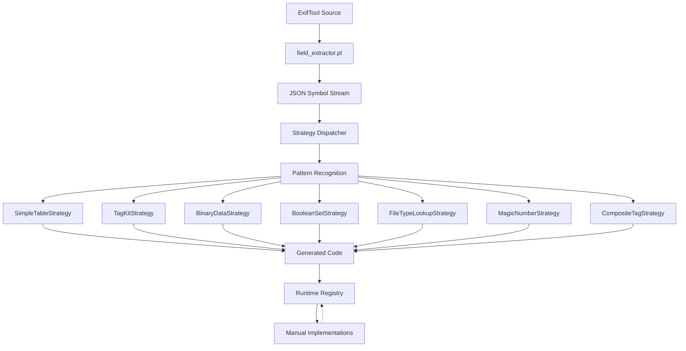

# ExifTool Integration: Code Generation & Implementation

**🚨 CRITICAL: All integration follows [TRUST-EXIFTOOL.md](TRUST-EXIFTOOL.md) - we translate ExifTool exactly, never innovate.**

**⚠️ MANUAL PORTING BANNED**: We've had 100+ bugs from manual transcription of ExifTool data. All ExifTool data MUST be extracted automatically.

This document describes the complete system for integrating ExifTool's metadata extraction capabilities into exif-oxide through automated code generation and manual implementations.

## Overview

The ExifTool integration system uses a **unified strategy-based architecture** that combines automated pattern recognition with targeted manual implementations:

### Architecture Evolution

**🎯 CURRENT SYSTEM (2025)**: **Unified Strategy Pattern**
- **Universal extraction**: Single `field_extractor.pl` discovers ALL ExifTool symbols automatically
- **Dynamic processing**: Rust strategies compete to recognize and process symbol patterns 
- **Comprehensive discovery**: No manual configuration needed - finds all tables in any module
- **Pattern-driven**: Code generation based on symbol structure, not hardcoded extractors

**📚 LEGACY SYSTEM**: **Config-Based Extractors** (see [Historical Approach](#historical-config-based-approach))
- Multiple specialized extractors (`tag_kit.pl`, `simple_table.pl`, etc.)  
- Manual configuration files specify what to extract
- Static discovery limited to configured tables

### Generated Components

- **Tag tables** with runtime conversion references and complete PrintConv implementations
- **Lookup tables** from manufacturer modules (Canon white balance, Nikon lenses, etc.)
- **File type detection** patterns and discriminated unions
- **Boolean membership sets** for fast existence checking
- **Binary data processors** for structured data parsing
- **Reference lists** showing what manual implementations are needed

### Manual Components

- **Conversion functions** (PrintConv/ValueConv) with complex logic
- **Manufacturer processors** for binary data parsing
- **Encryption/decryption** algorithms  
- **Format handlers** for variable-length data structures

**Core Principle**: Generated code provides data and structure; manual code provides ExifTool-equivalent logic. Complex logic is never generated - it's faithfully translated from ExifTool source.

## System Architecture

### Unified Strategy Pattern (Current)



**Key Benefits:**
- **🔍 Complete Discovery**: Finds ALL symbols in any ExifTool module automatically
- **🧩 Duck Typing**: Strategies recognize patterns without manual configuration
- **⚡ Dynamic Processing**: New modules work immediately without configuration
- **🔧 Extensible**: Add new strategies without changing extraction layer

### Unified Build System (Current)

```
codegen/
├── src/                        # Rust orchestration (strategy pattern)
│   ├── main.rs                # Command-line interface and coordination
│   ├── field_extractor.rs     # Interface to field_extractor.pl
│   ├── strategies/            # Strategy pattern implementations
│   │   ├── mod.rs             # Strategy dispatcher and trait definition
│   │   ├── simple_table.rs    # Simple key-value lookup tables
│   │   ├── tag_kit.rs         # Complete tag definitions with PrintConv
│   │   ├── binary_data.rs     # ProcessBinaryData table structures
│   │   ├── boolean_set.rs     # Membership testing sets
│   │   ├── composite_tag.rs   # Calculated/composite tags
│   │   ├── file_type_lookup.rs # File type discrimination
│   │   ├── magic_number.rs    # Binary signature patterns
│   │   ├── mime_type.rs       # MIME type mappings
│   │   └── output_locations.rs # Output path utilities
│   ├── conv_registry.rs       # PrintConv/ValueConv function registry
│   └── common.rs              # Shared utilities
├── scripts/                   # Perl extraction scripts
│   ├── field_extractor.pl     # ⭐ UNIVERSAL EXTRACTOR - extracts all symbols
│   └── patch_all_modules.sh   # ExifTool patching utilities
├── extractors/               # 📚 LEGACY - Individual extractors (historical)
│   ├── tag_kit.pl            # Legacy tag extraction
│   ├── simple_table.pl       # Legacy table extraction
│   └── [others...]           # Preserved for reference/migration
└── generated/                # Generated output files
```

**🎯 Key Change**: Single universal `field_extractor.pl` replaces dozens of specialized extractors.

### Runtime System

```
src/
├── registry.rs                    # Function lookup registry
├── implementations/               # Manual conversion functions
│   ├── print_conv.rs             # PrintConv implementations
│   ├── value_conv.rs             # ValueConv implementations
│   └── [manufacturer]/          # Specialized processors
├── generated/                     # Generated lookup tables (modular structure)
│   ├── tags/                     # Semantic tag grouping (8 focused modules)
│   │   ├── core.rs               # Core EXIF tags (1,256 lines)
│   │   ├── camera.rs             # Camera-specific tags (376 lines)
│   │   ├── gps.rs                # GPS-related tags (365 lines)
│   │   ├── time.rs               # Time-related tags (123 lines)
│   │   ├── author.rs             # Author/copyright tags (46 lines)
│   │   ├── special.rs            # Special/mixed-group tags (46 lines)
│   │   ├── common.rs             # Shared types (33 lines)
│   │   └── mod.rs                # Re-exports and unified interface
│   ├── Canon_pm/                 # Canon.pm extractions (functional splitting)
│   │   ├── canonimagesize.rs     # Image size lookup
│   │   ├── canonwhitebalance.rs  # White balance lookup
│   │   ├── canonmodelid.rs       # Model ID lookup
│   │   ├── canonquality.rs       # Quality lookup
│   │   ├── picturestyles.rs      # Picture styles lookup
│   │   └── mod.rs                # Re-exports all Canon tables
│   ├── ExifTool_pm/              # ExifTool.pm extractions (6 functional modules)
│   │   ├── mimetype.rs           # MIME type lookup
│   │   ├── filetypeext.rs        # File type extension lookup
│   │   ├── weakmagic.rs          # Weak magic patterns
│   │   ├── createtypes.rs        # Create types
│   │   ├── processtype.rs        # Process types
│   │   ├── ispc.rs               # IsPC checks
│   │   └── mod.rs                # Re-exports all ExifTool tables
│   ├── XMP_pm/                   # XMP.pm extractions (5 functional modules)
│   │   ├── nsuri.rs              # Namespace URI lookup
│   │   ├── xmpns.rs              # XMP namespace lookup
│   │   ├── charname.rs           # Character name lookup
│   │   ├── charnum.rs            # Character number lookup
│   │   ├── stdxlatns.rs          # Standard translation namespace
│   │   └── mod.rs                # Re-exports all XMP tables
│   ├── Nikon_pm/                 # Nikon.pm extractions (including static arrays)
│   │   ├── nikonlensids.rs       # Lens ID lookup
│   │   ├── xlat_0.rs             # XLAT encryption array [0] (256 bytes)
│   │   ├── xlat_1.rs             # XLAT encryption array [1] (256 bytes)  
│   │   └── mod.rs                # Re-exports all Nikon tables and arrays
│   ├── Exif_pm/                  # Exif.pm extractions
│   │   ├── orientation.rs        # Orientation lookup
│   │   └── mod.rs                # Re-exports all Exif tables
│   ├── PNG_pm/                   # PNG.pm extractions (3 functional modules)
│   │   ├── isdatchunk.rs         # IsDatChunk checks
│   │   ├── istxtchunk.rs         # IsTxtChunk checks
│   │   ├── noleapfrog.rs         # NoLeapFrog checks
│   │   └── mod.rs                # Re-exports all PNG tables
│   └── file_types/               # File type detection
│       ├── file_type_lookup.rs   # File type lookup
│       ├── magic_number_patterns.rs # Magic number patterns
│       └── mod.rs                # Re-exports all file type tables
└── processor_registry/           # Advanced processor architecture
    ├── traits.rs                # BinaryDataProcessor trait
    └── capability.rs            # Capability assessment
```

## How the Strategy Pattern Works

The unified strategy system operates in three phases:

### Phase 1: Universal Extraction

```bash
# field_extractor.pl extracts ALL hash symbols from any ExifTool module
field_extractor.pl third-party/exiftool/lib/Image/ExifTool/Canon.pm
```

**Output**: Stream of JSON symbols with structure information:
```json
{
  "type": "hash",
  "name": "canonWhiteBalance", 
  "data": {"0": "Auto", "1": "Daylight", "2": "Cloudy"},
  "module": "Canon",
  "metadata": {"size": 3, "is_composite_table": 0}
}
```

### Phase 2: Strategy Competition

Each strategy implements `can_handle()` to claim symbols:

```rust
impl ExtractionStrategy for SimpleTableStrategy {
    fn can_handle(&self, symbol: &FieldSymbol) -> bool {
        // Duck typing: Does this look like a simple lookup table?
        if let JsonValue::Object(map) = &symbol.data {
            map.values().all(|v| v.is_string()) && 
            !symbol.name.contains("Composite") &&
            !map.contains_key("PrintConv")
        } else {
            false
        }
    }
}
```

**Strategy Priority Order** (first-match wins):

1. **`CompositeTagStrategy`** - Composite tag definitions (highest priority)
   - **Pattern**: `is_composite_table: 1` metadata flag from field extractor
   - **Example**: GPS coordinates calculated from latitude/longitude components
   - **Why First**: Most specific pattern - must be claimed before TagKitStrategy

2. **`FileTypeLookupStrategy`** - ExifTool file type discrimination  
   - **Pattern**: Objects with `Description` + `Format` fields, plus string aliases
   - **Example**: `JPEG => { Description => 'JPEG image', Format => 'JPEG' }, JPG => 'JPEG'`
   - **Why High Priority**: Complex discriminated union pattern needs precedence

3. **`MagicNumberStrategy`** - Binary signature patterns
   - **Pattern**: Keys containing binary escape sequences like `\xff\xd8\xff`
   - **Example**: `JPEG => '\xff\xd8\xff', PNG => '\x89PNG\r\n\x1a\n'`
   - **Why High Priority**: Binary patterns are highly specific

4. **`MimeTypeStrategy`** - MIME type mappings
   - **Pattern**: Simple string-to-string mappings for known MIME types
   - **Example**: `jpg => 'image/jpeg', png => 'image/png'`
   - **Why Before Simple**: Specialized string mapping pattern

5. **`SimpleTableStrategy`** - Key-value lookup tables  
   - **Pattern**: Hash with all string values, no PrintConv/tag markers
   - **Example**: `canonWhiteBalance: {"0": "Auto", "1": "Daylight", "2": "Cloudy"}`
   - **Why Middle Priority**: Claims mixed-key tables like `canonLensTypes` before TagKit

6. **`ScalarArrayStrategy`** - Arrays of primitive values
   - **Pattern**: Arrays containing only numbers, strings, or simple data types
   - **Example**: `xlat: [0x01, 0x02, 0x03, ...]` (Nikon encryption arrays)
   - **Why Before TagKit**: Simple arrays should be claimed before complex processing

7. **`TagKitStrategy`** - Complex tag definitions with PrintConv
   - **Pattern**: Tables with `WRITABLE`, `GROUPS`, or tag fields like `Name`, `Format`
   - **Example**: `Main: {0x01: {Name: "ImageWidth", Format: "int32u", PrintConv: "sprintf"}}`
   - **Why Lower Priority**: Broad pattern - processes what other strategies don't claim

8. **`BinaryDataStrategy`** - ProcessBinaryData structures
   - **Pattern**: Tables with binary data attributes and processing metadata
   - **Example**: Camera settings binary blocks with offset processing
   - **Why Late**: Specialized pattern for binary processing tables

9. **`BooleanSetStrategy`** - Membership testing sets (lowest priority)
   - **Pattern**: Hash where all values equal `1` (membership sets)
   - **Example**: `isDatChunk: {"IHDR": 1, "PLTE": 1, "IDAT": 1}`
   - **Why Last**: Fallback pattern for simple membership testing

### Phase 3: Code Generation

Each strategy generates appropriate Rust code:

```rust
// SimpleTableStrategy output
pub static WHITE_BALANCE: LazyLock<HashMap<u8, &'static str>> = LazyLock::new(|| {
    [(0, "Auto"), (1, "Daylight"), (2, "Cloudy")].iter().copied().collect()
});

pub fn lookup_white_balance(key: u8) -> Option<&'static str> {
    WHITE_BALANCE.get(&key).copied()
}
```

### Key Advantages

- **🔍 Complete Discovery**: No configuration needed - finds ALL symbols automatically
- **🎯 Pattern Recognition**: Strategies compete using duck typing for accurate classification
- **⚡ Zero Configuration**: New modules work immediately without manual setup
- **🧪 Testable**: Each strategy can be unit tested independently
- **📈 Extensible**: Add new pattern types without modifying extraction layer

### Strategy Pattern Debugging

The unified system provides comprehensive debugging through strategy selection logs:

**Debug Commands:**
```bash
# Debug strategy selection decisions
cd codegen && RUST_LOG=debug cargo run

# Trace-level pattern matching details  
cd codegen && RUST_LOG=trace cargo run

# Strategy selection log analysis
cat codegen/generated/strategy_selection.log | head -20
```

**Strategy Selection Log Format:**
```
# Strategy Selection Log
# Format: Symbol Module Strategy Reasoning

canonWhiteBalance Canon SimpleTableStrategy Pattern matched: string map (3 keys)
Main Canon TagKitStrategy Pattern matched: tag definition with conversions
isCompressedRAW Sony BooleanSetStrategy Pattern matched: membership set (8 keys)
magicNumber ExifTool MagicNumberStrategy Pattern matched: binary patterns with escape sequences
```

**Debugging Strategy Conflicts:**

If a symbol isn't processed as expected, check the strategy log:

1. **Symbol Not Found**: Symbol might be filtered out during extraction
2. **Wrong Strategy**: Check strategy priority order - first match wins
3. **Pattern Mismatch**: Strategy's `can_handle()` logic might need adjustment

**Adding Debug Output to Strategies:**

```rust
fn can_handle(&self, symbol: &FieldSymbol) -> bool {
    let result = // ... pattern recognition logic
    debug!("MyStrategy::can_handle({}) -> {} (reason: {})", symbol.name, result, reason);
    result
}
```

### Strategy Development Guide

**Creating New Strategies** for unrecognized patterns:

1. **Identify the Pattern**: Check `strategy_selection.log` for unmatched symbols
2. **Create Strategy**: Implement `ExtractionStrategy` trait
3. **Pattern Recognition**: Define precise `can_handle()` logic using duck typing
4. **Code Generation**: Generate appropriate Rust code for the pattern
5. **Priority Placement**: Insert at correct priority level in `all_strategies()`

**Example New Strategy Implementation:**

```rust
// src/strategies/my_new_pattern.rs
use super::{ExtractionContext, ExtractionStrategy, GeneratedFile};
use crate::field_extractor::FieldSymbol;

pub struct MyNewPatternStrategy {
    recognized_symbols: Vec<FieldSymbol>,
}

impl ExtractionStrategy for MyNewPatternStrategy {
    fn name(&self) -> &'static str {
        "MyNewPatternStrategy"
    }

    fn can_handle(&self, symbol: &FieldSymbol) -> bool {
        // Duck-typing pattern recognition
        if let JsonValue::Object(map) = &symbol.data {
            // Example: recognize pattern where all keys are hex numbers
            let all_hex_keys = map.keys().all(|k| k.starts_with("0x"));
            let has_special_marker = map.contains_key("special_field");
            
            all_hex_keys && has_special_marker
        } else {
            false
        }
    }

    fn extract(&mut self, symbol: &FieldSymbol, context: &mut ExtractionContext) -> Result<()> {
        context.log_strategy_selection(
            symbol,
            self.name(),
            "Detected hex key pattern with special marker"
        );
        
        self.recognized_symbols.push(symbol.clone());
        Ok(())
    }

    fn finish_module(&mut self, _module_name: &str) -> Result<()> {
        Ok(())
    }

    fn finish_extraction(&mut self) -> Result<Vec<GeneratedFile>> {
        let mut files = Vec::new();
        
        for symbol in &self.recognized_symbols {
            let code = self.generate_rust_code(symbol)?;
            files.push(GeneratedFile {
                path: format!("{}/special_pattern.rs", symbol.module.to_lowercase()),
                content: code,
                strategy: self.name().to_string(),
            });
        }
        
        self.recognized_symbols.clear();
        Ok(files)
    }
}

impl MyNewPatternStrategy {
    fn generate_rust_code(&self, symbol: &FieldSymbol) -> Result<String> {
        // Generate appropriate Rust code for this pattern type
        Ok(format!("// Generated code for {}", symbol.name))
    }
}
```

**Register New Strategy** (priority matters - first match wins):

```rust
// In strategies/mod.rs all_strategies() function
pub fn all_strategies() -> Vec<Box<dyn ExtractionStrategy>> {
    vec![
        Box::new(CompositeTagStrategy::new()),     // Highest priority
        Box::new(FileTypeLookupStrategy::new()),
        Box::new(MyNewPatternStrategy::new()),     // <- Add at appropriate priority
        Box::new(SimpleTableStrategy::new()),
        // ... rest of strategies
    ]
}
```

**Testing Your Strategy:**

```rust
#[cfg(test)]
mod tests {
    use super::*;
    use serde_json::json;

    #[test] 
    fn test_hex_key_pattern_recognition() {
        let strategy = MyNewPatternStrategy::new();
        
        let hex_pattern = FieldSymbol {
            name: "testPattern".to_string(),
            data: json!({"0x01": "value1", "0x02": "value2", "special_field": "marker"}),
            module: "Test".to_string(),
            // ... metadata
        };
        
        assert!(strategy.can_handle(&hex_pattern));
    }
}
```

## Strategy Philosophy vs Legacy Config Approach

### 🎯 Current Strategy Approach: Zero Configuration

**The unified strategy system eliminates configuration files entirely.**

**How it works:**
1. **Universal Discovery**: `field_extractor.pl` finds ALL symbols in any ExifTool module
2. **Pattern Recognition**: Strategies compete to claim symbols based on structure  
3. **Dynamic Processing**: No manual configuration required

**Benefits:**
- **🚀 Instant Support**: New modules work immediately without configuration
- **🔍 Complete Discovery**: Finds symbols you didn't know existed
- **🧪 Testable**: Each strategy has clear pattern recognition rules
- **📈 Scalable**: Adding new pattern types doesn't require config updates

### 📚 Legacy Config Philosophy (Historical)

**Note**: The config-based system is preserved for reference and migration purposes.

**CRITICAL**: Configuration files specify **WHAT** to extract, not extracted data itself.

#### Simple Config Principle (Legacy)

**✅ CORRECT** - Simple declarative config (10-20 lines):
```json
{
  "extractor": "tag_kit.pl",
  "source": "third-party/exiftool/lib/Image/ExifTool/Canon.pm",
  "description": "Canon camera tag definitions",
  "tables": [
    {
      "table_name": "CameraSettings",
      "description": "Canon camera settings with inline PrintConv"
    }
  ]
}
```

**❌ WRONG** - Config containing extracted data (100+ lines):
```json
{
  "tag_kits": [
    {
      "name": "CanonCameraSettings",
      "tags": [
        {"tag_id": "1", "name": "MacroMode", "format": "int16s"},
        {"tag_id": "2", "name": "SelfTimer", "format": "int16s"},
        // ... 500+ more lines of extracted data
      ]
    }
  ]
}
```

#### Architecture Flow Comparison

**🎯 CURRENT (Strategy Pattern)**: Universal Extraction → Pattern Recognition → Generated Code
1. **field_extractor.pl** discovers all symbols automatically
2. **Strategies** compete to process symbols based on duck-typing
3. **Generated code** contains appropriate data structures

**📚 LEGACY (Config-Based)**: Config → Extractor → Generated Code
1. **Simple config** specifies tables to extract
2. **Extractor** runs during `make codegen` 
3. **Generated code** contains the extracted data structures

**❌ BROKEN**: Config → Extractor → Config → Extractor (circular dependency)
1. Script generates config containing extracted data
2. Config becomes the data source instead of ExifTool
3. Updates require regenerating configs instead of updating source

#### Legacy Validation Rules

- **Config files should be <100 lines** - if larger, you're doing extraction in config instead of letting extractors do their job
- **Configs should be human-readable and git-diffable** - engineers should understand what's being extracted
- **Configs describe intent** ("extract Canon camera settings"), **not implementation** (actual tag structures)
- **Source of truth remains ExifTool** - configs just point to what to extract

### 🎯 Current Workflow: Unified Strategy System

**Standard Workflow for New Modules** (Zero Configuration Required):
1. **Universal Processing**: `make codegen` - automatically discovers and processes ALL symbols
2. **Pattern Recognition**: Strategies compete to claim symbols based on structure
3. **Code Generation**: Generated code appears automatically in `src/generated/`

**Command Examples:**
```bash
# Process all ExifTool modules with unified system
make codegen

# Process specific module (for development/debugging)
cd codegen && RUST_LOG=debug cargo run -- --module Canon
```

**Key Benefits of Strategy System**:
- **🔍 Complete Discovery**: Finds ALL symbols in any ExifTool module automatically
- **⚡ Zero Configuration**: New modules work immediately without setup
- **🧪 Pattern Recognition**: Duck-typing accurately classifies symbols
- **📈 Extensible**: Add new strategies without touching extraction layer

### 📚 Legacy Workflow: Config-Based System (Historical)

**Legacy Workflow for New Modules** (Preserved for Reference):
1. **Universal Patching**: `./scripts/patch_all_modules.sh` (patches all modules at once)
2. **Config Generation**: `perl scripts/auto_config_gen.pl ../third-party/exiftool/lib/Image/ExifTool/ModuleName.pm`
3. **Code Generation**: `make codegen`

**Legacy Individual Tools**:
- `scripts/patch_all_modules.sh` - **Recommended**: Patches all ExifTool modules for symbol table access
- `scripts/auto_config_gen.pl` - Symbol table introspection to generate simple configs (finds ALL tables)
- `scripts/patch_exiftool_modules_universal.pl` - Individual module patching (used by auto_config_gen.pl)
- Expression parser - Handles most conversion logic automatically
- PrintConv/ValueConv registry - Handles exotic conversion cases only

**Benefits of Legacy Universal Patching**:
- **Complete Discovery**: Finds ALL tag tables (171 tables in Nikon vs ~10 manually)
- **Zero Maintenance**: Once patched, always accessible for symbol table introspection
- **Safe & Reversible**: Only converts top-level `my` to `our`, semantically equivalent
- **Eliminates Manual Errors**: No more missing tables or transcription mistakes

## Daily Development Workflow

### 🎯 Current Strategy-Based Development

#### 1. Adding New PrintConv/ValueConv Functions

**Step 1: Identify Need**

```bash
# Test on real images to see what's missing
cargo run -- photo.jpg --show-missing

# Output shows:
# Missing implementations:
# - orientation_print_conv (EXIF:Orientation)
# - canon_wb_lookup (Canon:WhiteBalance)
```

**Step 2: Check Generated Code First**

```bash
# Strategy system automatically generates lookup tables
# Check if the table already exists:
ls src/generated/exif/orientation.rs
ls src/generated/canon/white_balance.rs
```

**Step 3: Implement Using Generated Tables**

```rust
/// EXIF Orientation PrintConv
/// ExifTool: lib/Image/ExifTool/Exif.pm:281-290 (%orientation hash)
/// Generated by SimpleTableStrategy
pub fn orientation_print_conv(val: &TagValue) -> TagValue {
    use crate::generated::exif::lookup_orientation;

    if let Some(orientation_val) = val.as_u8() {
        if let Some(description) = lookup_orientation(orientation_val) {
            return TagValue::string(description);
        }
    }
    TagValue::string(format!("Unknown ({val})"))
}
```

**Step 4: Register Function**

```rust
// In implementations/mod.rs
pub fn register_all_conversions() {
    registry::register_print_conv("orientation_print_conv", print_conv::orientation_print_conv);
}
```

**Step 5: Test**

```bash
# Verify against ExifTool
exiftool -j test.jpg > expected.json
cargo run -- test.jpg > actual.json
# Compare orientation values
```

#### 2. Adding Support for New Symbol Types

**If you find a pattern that no strategy recognizes:**

1. **Analyze the pattern** in the `strategy_selection.log` file
2. **Create new strategy** implementing `ExtractionStrategy`
3. **Add pattern recognition** in `can_handle()` method
4. **Register strategy** in `all_strategies()` with proper priority

**Example new strategy:**
```rust
pub struct MyNewStrategy {
    // Implementation
}

impl ExtractionStrategy for MyNewStrategy {
    fn can_handle(&self, symbol: &FieldSymbol) -> bool {
        // Pattern recognition logic here
    }
    
    fn extract(&mut self, symbol: &FieldSymbol, context: &mut ExtractionContext) -> Result<()> {
        // Processing logic here
    }
}
```

### 2. Using Generated Lookup Tables

Generated tables integrate seamlessly with manual functions:

```rust
// Generated: Canon white balance lookup
use crate::generated::Canon_pm::lookup_canon_white_balance;

// Manual: PrintConv function using generated table
pub fn canon_wb_print_conv(value: &TagValue) -> TagValue {
    if let Some(wb) = value.as_u8() {
        if let Some(name) = lookup_canon_white_balance(wb) {
            return TagValue::string(name);
        }
    }
    TagValue::string(format!("Unknown ({value})"))
}
```

### 3. Tag-Specific Registry System + Expression Compiler

The PrintConv/ValueConv system uses a four-tier lookup hierarchy to map tags to their conversion functions:

#### Four-Tier Lookup System (Updated P17)

1. **Module::Tag Lookup** (highest priority)
   - Module-specific implementations for tags that behave differently per manufacturer
   - Example: `Canon_pm::WhiteBalance` → `canon_white_balance_print_conv`

2. **🎉 NEW: Expression Compiler** (automatic compilation)
   - **Compiles most expressions automatically** - no manual registry entries needed
   - **sprintf patterns**: `sprintf("%.1f mm",$val)` → generates `format!("{:.1} mm", val)` directly
   - **ExifTool functions**: `Image::ExifTool::Exif::PrintFNumber($val)` → direct call to `fnumber_print_conv(val)`
   - **Ternary expressions**: `$val >= 0 ? $val : undef` → generates `if val >= 0.0 { val } else { undef }`
   - **String interpolation**: `"$val mm"` → generates `format!("{} mm", val)`

3. **Expression Registry Fallback** (third priority)
   - **Only for non-compilable expressions** - regex operations, power operations (`2 ** x`)
   - Example: `$val =~ /^(inf|undef)$/ ? $val : "$val m"` → `gpsaltitude_print_conv`

4. **Universal Tag Lookup** (fallback)
   - Tags that work the same across all modules
   - Example: `Flash` → `flash_print_conv` (works for all manufacturers)

#### Implementation

**Registry Definition** (`codegen/src/conv_registry.rs`):

```rust
// Tag-specific registry for ComplexHash and other special cases
// Key format: "ModuleName::TagName" or just "TagName" for universal tags
static TAG_SPECIFIC_PRINTCONV: LazyLock<HashMap<&'static str, (&'static str, &'static str)>> = LazyLock::new(|| {
    let mut m = HashMap::new();
    
    // Module-specific tags (highest priority)
    // m.insert("Canon_pm::WhiteBalance", ("crate::implementations::print_conv", "canon_white_balance_print_conv"));
    
    // Universal tags (work across all modules - fallback)
    m.insert("Flash", ("crate::implementations::print_conv", "flash_print_conv"));
    
    m
});
```

**Lookup Function**:

```rust
/// Look up a tag-specific PrintConv in the registry
/// First tries module-specific lookup (Module::Tag), then universal lookup (Tag)
pub fn lookup_tag_specific_printconv(module: &str, tag_name: &str) -> Option<(&'static str, &'static str)> {
    // First try module-specific lookup
    let module_key = format!("{}::{}", module, tag_name);
    if let Some(result) = TAG_SPECIFIC_PRINTCONV.get(module_key.as_str()).copied() {
        return Some(result);
    }
    
    // Then try universal lookup
    TAG_SPECIFIC_PRINTCONV.get(tag_name).copied()
}
```

**Generator Integration** (`codegen/src/generators/tag_kit_modular.rs`):

```rust
// Three-tier lookup system:
// 1. First try tag-specific lookup (works for all tags, not just ComplexHash)
if let Some((module_path, func_name)) = lookup_tag_specific_printconv(module_name, &tag_kit.name) {
    tag_convs_map.insert(tag_id, (module_path.to_string(), func_name.to_string()));
    continue;
}

// 2. Then try expression/manual lookup based on type
match tag_kit.print_conv_type.as_str() {
    "Expression" => { /* lookup by expression */ }
    "Manual" => { /* lookup by manual name */ }
    _ => {}
}
```

#### When to Use Tag-Specific Registry

Add entries to `TAG_SPECIFIC_PRINTCONV` when:

1. **ComplexHash Tags**: Tags marked as "ComplexHash" in ExifTool (like Flash)
2. **Module-Specific Behavior**: Tags that need different handling per manufacturer
3. **Override Standard Expression**: When a tag needs special handling despite having a standard expression
4. **DRY Principle**: Universal tags that work the same across all modules

#### ValueConv Expression System

ValueConv functions convert raw tag values to logical values. The system uses a hybrid approach combining inline code generation for simple arithmetic with custom functions for complex expressions.

**Expression Classification** (`codegen/src/conv_registry.rs`):

```rust
#[derive(Debug, Clone, PartialEq)]
pub enum ValueConvType {
    Compilable,     // Simple arithmetic - generates inline code
    Function,       // Complex logic - uses custom function
}

/// Classify ValueConv expressions for codegen processing
pub fn classify_valueconv_expression(expr: &str) -> ValueConvType {
    use crate::expression_compiler::ExpressionCompiler;
    
    let compiler = ExpressionCompiler::new();
    if compiler.is_compilable(expr) {
        ValueConvType::Compilable  // Generate inline arithmetic
    } else {
        ValueConvType::Function   // Use custom function
    }
}
```

**Arithmetic Expression Compiler** (`codegen/src/expression_compiler.rs`):

The system includes a complete Shunting Yard algorithm implementation that compiles simple arithmetic expressions at codegen time:

```rust
/// Compile arithmetic expressions to inline Rust code
/// Examples: "$val / 8" → "val / 8.0", "($val-104)/8" → "(val - 104.0) / 8.0"
pub fn try_generate_simple_arithmetic(expr: &str) -> Option<String> {
    // Parse expression using Shunting Yard algorithm
    let tokens = self.tokenize_expression(expr)?;
    let rpn = self.shunting_yard(&tokens)?;
    
    // Generate direct arithmetic for simple cases
    if self.is_simple_arithmetic(&rpn) {
        return Some(self.generate_direct_arithmetic(&rpn));
    }
    
    None // Fall back to stack-based evaluation for complex cases
}
```

**Generated Code Examples**:

```rust
// Instead of function call:
0x1234 => divide_8_value_conv(value)

// Generate inline arithmetic:
0x1234 => {
    match value.as_f64() {
        Some(val) => Ok(TagValue::F64(val / 8.0)),
        None => Ok(value.clone()),
    }
}
```

**Expression Categories**:

- **Compilable (12 expressions)**: Simple arithmetic like `$val * 100`, `$val / 8`, `($val-104)/8`
- **Custom Functions (11+ expressions)**: Complex logic like `2 ** (-$val/3)`, `$val ? 10 / $val : 0`

**Benefits of Inline Generation**:

- **Performance**: Direct arithmetic beats function call overhead
- **Maintainability**: No individual functions to maintain for each arithmetic pattern
- **Type Safety**: All generated code uses proper f64 arithmetic with `.0` literals
- **Zero Dependencies**: No runtime parsing or expression evaluation

**Complex ValueConv Registry** (`codegen/src/conv_registry.rs`):

```rust
static VALUECONV_REGISTRY: LazyLock<HashMap<&'static str, (&'static str, &'static str)>> = LazyLock::new(|| {
    let mut m = HashMap::new();
    
    // Complex expressions that need custom functions
    m.insert("2 ** (-$val/3)", ("crate::implementations::value_conv", "power_neg_div_3_value_conv"));
    m.insert("$val ? 10 / $val : 0", ("crate::implementations::value_conv", "reciprocal_10_value_conv"));
    
    // String processing patterns  
    m.insert("$val=~s/ +$//; $val", ("crate::implementations::value_conv", "trim_whitespace_value_conv"));
    
    // GPS coordinate conversion
    m.insert("gpslatitude_value_conv", ("crate::implementations::value_conv", "gps_coordinate_value_conv"));
    
    m
});
```

**How to Add New Patterns**:

1. **Simple arithmetic**: Just add to tag kit config - automatically compiled to inline code
2. **Complex expressions**: Add registry entry and implement custom function in `src/implementations/value_conv.rs`
3. **Regenerate**: Run `make codegen` - expressions automatically become inline code or function names

The system automatically determines whether to generate inline arithmetic or use custom functions based on expression complexity.

### 4. Adding Simple Array Extraction

**Step 1: Add Array Configuration**

```json
// In codegen/config/Nikon_pm/simple_array.json
{
  "description": "Nikon XLAT arrays for encryption/decryption",
  "arrays": [
    {
      "array_name": "xlat[0]",
      "constant_name": "XLAT_0",
      "element_type": "u8",
      "size": 256,
      "description": "First XLAT encryption array"
    },
    {
      "array_name": "xlat[1]", 
      "constant_name": "XLAT_1",
      "element_type": "u8",
      "size": 256,
      "description": "Second XLAT encryption array"
    }
  ]
}
```

**Step 2: Generate and Use**

```bash
# Regenerate code (auto-patches ExifTool modules)
make codegen

# Use in implementation
use crate::generated::Nikon_pm::{XLAT_0, XLAT_1};

// Direct array indexing (fastest)
let decrypted_byte = XLAT_0[encrypted_value as usize];

// Bounds-checked access
if let Some(&decrypted_byte) = XLAT_0.get(encrypted_value as usize) {
    // Safe access
}
```

**Complex Expression Support**: The simple_array extractor handles arbitrary Perl expressions:

- **Indexed arrays**: `xlat[0]`, `xlat[1]`, `rggb[2]`
- **Simple arrays**: `@afPointNames`, `@lensMounts`
- **Complex expressions**: `%widget->payload`, `@{$hash{key}}`

**Validation**: Arrays are validated for byte-perfect accuracy:

```bash
# Perl validation script
perl codegen/scripts/validate_arrays.pl config/Nikon_pm/simple_array.json

# Rust integration tests  
cargo test --test simple_array_integration
```

### 5. Adding Simple Extraction Types

**Step 1: Add to Configuration**

```json
// In codegen/config/Canon_pm/simple_table.json
{
  "description": "Canon.pm simple lookup tables",
  "tables": [
    {
      "hash_name": "%newCanonTable",
      "constant_name": "NEW_CANON_SETTING",
      "key_type": "u8",
      "description": "Canon new setting names"
    }
  ]
}
```

**Step 2: Generate and Use**

```bash
# Regenerate code (auto-patches ExifTool modules)
make codegen

# Use in implementation
use crate::generated::Canon_pm::lookup_new_canon_setting;
```

**Note**: The build system automatically patches ExifTool modules to expose `my`-scoped variables as package variables based on entries in configuration files. No manual patching is required.

## Code Generation System

### Direct Code Generation

The system generates simple, direct Rust code without macros:

```rust
// Generated lookup table using std::sync::LazyLock (no external dependencies)
pub static ORIENTATION: LazyLock<HashMap<u8, &'static str>> = LazyLock::new(|| {
    let mut map = HashMap::new();
    map.insert(1, "Horizontal (normal)");
    map.insert(2, "Mirror horizontal");
    // ... more entries
    map
});

// Generated lookup function
pub fn lookup_orientation(key: u8) -> Option<&'static str> {
    ORIENTATION.get(&key).copied()
}
```

This approach prioritizes:

- **Readability**: Generated code looks like hand-written Rust
- **Debuggability**: Stack traces point to real code, not macro expansions
- **IDE Support**: Autocomplete and go-to-definition work perfectly
- **Simplicity**: No macro expertise needed to understand or modify

### Extraction Types

The system supports three extraction patterns:

#### Simple Tables

```perl
# Basic key-value lookups
%canonWhiteBalance = (
    0 => 'Auto',
    1 => 'Daylight',
    2 => 'Cloudy',
);
```

#### Regex Patterns

```perl
# File type magic numbers (may contain non-UTF-8 bytes)
%magicNumber = (
    JPEG => '\xff\xd8\xff',
    PNG  => '\x89PNG\r\n\x1a\n',
    BPG  => 'BPG\xfb',  # Contains raw byte 0xFB
);
```

#### File Type Lookup

```perl
# Discriminated unions with aliases
%fileTypeLookup = (
    JPEG => { Description => 'JPEG image', Format => 'JPEG' },
    JPG  => 'JPEG',  # Alias
);
```

### Generated Code Benefits

- **Type Safety**: Proper Rust types for all keys
- **Performance**: LazyLock HashMap lookups with direct generation
- **Simplicity**: No macro complexity - generated code is plain Rust
- **Debugging**: Easy to read and debug generated functions
- **Traceability**: Every entry references ExifTool source
- **Maintenance**: Automatic updates with ExifTool releases
- **Integration**: Seamless use in manual functions via clean imports
- **Scalability**: Modular structure with semantic grouping and functional splitting
- **Binary Safety**: Proper handling of non-UTF-8 bytes in patterns
- **Minimal Dependencies**: Uses std::sync::LazyLock, no external crates for core functionality

### 🎯 Current Strategy Selection Guide

The unified strategy system replaces individual extractors with pattern recognition. Strategies compete to claim symbols based on duck-typing pattern analysis.

#### Available Strategies (Priority Order)

**1. `CompositeTagStrategy`** - Composite tag definitions (highest priority)
  - **Pattern**: Symbols marked `is_composite_table: 1` 
  - **Handles**: Tags calculated from other tags with dependencies
  - **Output**: Composite tag definitions with requirements

**2. `FileTypeLookupStrategy`** - ExifTool file type discrimination
  - **Pattern**: Objects with `Description`, `Format` fields and string aliases
  - **Handles**: File type detection with discriminated unions
  - **Output**: File format identification code

**3. `MagicNumberStrategy`** - Binary signature patterns  
  - **Pattern**: Keys with binary escape sequences like `\xff\xd8\xff`
  - **Handles**: Magic number patterns for file detection
  - **Output**: Binary signature matching code with non-UTF-8 support

**4. `MimeTypeStrategy`** - MIME type mappings
  - **Pattern**: Simple string-to-string mappings for known MIME types
  - **Handles**: File extension to MIME type associations
  - **Output**: MIME type lookup tables

**5. `SimpleTableStrategy`** - Key-value lookup tables
  - **Pattern**: Hash with all string values, no PrintConv markers
  - **Handles**: Manufacturer lookup tables (white balance, lens IDs, etc.)
  - **Output**: Static HashMap lookup functions with type inference

**6. `TagKitStrategy`** - Complex tag definitions
  - **Pattern**: Tables with `WRITABLE`, `GROUPS`, or tag fields like `Name`, `Format`
  - **Handles**: Complete tag definitions with PrintConv implementations  
  - **Output**: Tag registry entries with conversion functions

**7. `BinaryDataStrategy`** - ProcessBinaryData structures
  - **Pattern**: Tables with binary data attributes and processing metadata
  - **Handles**: Binary data parsing table definitions
  - **Output**: Binary parsing structures and offset information

**8. `BooleanSetStrategy`** - Membership testing sets (lowest priority)
  - **Pattern**: Hash with all values equal to `1` (membership sets)
  - **Handles**: Fast existence checks (`isDatChunk`, `isTxtChunk`)
  - **Output**: HashSet membership testing functions

#### Pattern Recognition Logic

Each strategy implements smart pattern recognition:

```rust
// Example: SimpleTableStrategy recognizes lookup tables
fn can_handle(&self, symbol: &FieldSymbol) -> bool {
    if let JsonValue::Object(map) = &symbol.data {
        // All values must be strings
        let all_strings = map.values().all(|v| v.is_string());
        
        // Must not be a tag definition  
        let has_tag_markers = map.contains_key("PrintConv") || 
                             map.contains_key("Name");
        
        // Known lookup table patterns
        let known_tables = ["canonWhiteBalance", "nikonLensIDs"];
        let is_known = known_tables.contains(&symbol.name.as_str());
        
        (all_strings && !has_tag_markers) || is_known
    } else {
        false
    }
}
```

#### Strategy Benefits vs Legacy Extractors

- **🔍 Automatic Discovery**: No configuration needed - strategies automatically find and process symbols
- **🧩 Duck Typing**: Pattern recognition adapts to ExifTool's evolving symbol structures  
- **⚡ Zero Maintenance**: New ExifTool modules work immediately without config updates
- **🧪 Testable Logic**: Each strategy's recognition logic can be unit tested independently
- **📈 Extensible**: Add new strategies without modifying extraction layer

### 📚 Legacy Extractor Selection Guide (Historical)

**Note**: The individual extractor system is preserved for reference. See [EXTRACTOR-GUIDE.md](../reference/EXTRACTOR-GUIDE.md) for complete migration information.

The legacy config-based system used specialized extractors:
- `tag_kit.pl` - Tag definitions with PrintConv (→ `TagKitStrategy`)
- `simple_table.pl` - Lookup tables (→ `SimpleTableStrategy`) 
- `boolean_set.pl` - Membership sets (→ `BooleanSetStrategy`)
- `file_type_lookup.pl` - File type detection (→ `FileTypeLookupStrategy`)
- `composite_tags.pl` - Calculated tags (→ `CompositeTagStrategy`)

**Migration**: The strategy system provides equivalent functionality with automatic discovery and no configuration requirements.

### Non-UTF-8 Data Handling

The code generation system properly handles non-UTF-8 bytes found in ExifTool's binary patterns:

#### Pattern Escaping

The `escape_pattern_for_rust` function ensures all patterns are valid Rust string literals:

```rust
// Handles non-UTF-8 bytes like 0xFB in BPG magic number
fn escape_pattern_for_rust(pattern: &str) -> String {
    let mut escaped = String::new();

    for byte in pattern.bytes() {
        match byte {
            b'\\' => escaped.push_str("\\\\"),
            b'"' => escaped.push_str("\\\""),
            b'\n' => escaped.push_str("\\n"),
            b'\r' => escaped.push_str("\\r"),
            b'\t' => escaped.push_str("\\t"),
            // Non-ASCII or control characters become \xNN
            0x00..=0x1F | 0x7F..=0xFF => {
                escaped.push_str(&format!("\\x{:02x}", byte));
            }
            _ => escaped.push(byte as char),
        }
    }
    escaped
}
```

#### JSON Cleaning

When extracting patterns from ExifTool that contain raw bytes:

1. Perl extracts the data (may contain non-UTF-8)
2. Rust detects and cleans problematic bytes in JSON
3. Patterns are properly escaped for Rust string literals
4. Generated code contains valid UTF-8 with escape sequences

Example: BPG magic number `BPG\xfb` becomes `"BPG\\xfb"` in generated Rust code.

### 🎯 Current Build Pipeline: Unified Strategy System

The strategy-based build pipeline uses universal extraction with dynamic processing:

1. **Universal Extraction**: `field_extractor.pl` discovers ALL symbols in ExifTool modules
2. **Strategy Competition**: Rust strategies compete to claim symbols based on pattern recognition
3. **Code Generation**: Strategies generate appropriate Rust code for claimed symbols
4. **Module Assembly**: Generated files are organized into semantic modules

```bash
# Full pipeline with unified strategy system
make codegen              # Complete build - processes all ExifTool modules automatically

# Development commands  
cd codegen && cargo run --release                    # Run unified extraction + strategies
cd codegen && RUST_LOG=debug cargo run             # Verbose debug output
cd codegen && RUST_LOG=trace cargo run -- --module Canon  # Debug specific module
```

#### Strategy Processing Flow

1. **field_extractor.pl** extracts symbols from ExifTool modules (JSON stream)
2. **StrategyDispatcher** processes symbols through available strategies
3. **Pattern Recognition** - strategies compete using `can_handle()` methods
4. **Code Generation** - winning strategy generates appropriate Rust code
5. **File Organization** - generated files organized by module and type

**Key Benefits:**
- **🔍 Complete Discovery**: Automatically finds ALL symbols in any module
- **⚡ Zero Configuration**: No JSON configs or manual setup required  
- **🧪 Pattern Recognition**: Duck typing accurately classifies symbol types
- **📈 Extensible**: New strategies handle new patterns without changing extraction

### 📚 Legacy Build Pipeline: Config-Based System (Historical)

**Legacy system** (preserved for reference):

1. **Auto-discovery**: Rust scans `codegen/config/` directories for modules
2. **Configuration**: Each module has JSON configs with explicit `source` paths
3. **Patching**: Rust uses atomic file operations to temporarily patch ExifTool modules
4. **Extraction**: Rust calls Perl scripts with explicit file paths and hash names
5. **Generation**: Creates modular Rust code directly from individual JSON files
6. **Cleanup**: Makefile reverts ExifTool patches using git checkout

**Legacy Commands:**
```bash
# Legacy config-based system
make check-schemas       # Validate all configuration files
cd codegen && cargo run -- config/Canon_pm/simple_table.json    # Debug specific config
```

#### Architecture Evolution

**🎯 CURRENT (Strategy Pattern 2025)**:

- **Universal Extraction** - Single `field_extractor.pl` discovers all symbols  
- **Dynamic Processing** - Strategies compete based on pattern recognition
- **Zero Configuration** - No config files or manual setup needed
- **Complete Discovery** - Finds symbols you didn't know existed

**📚 LEGACY (Config-Based 2024)**:

- Complex Makefile with parallel extraction logic
- Perl scripts read JSON configs and knew about structure
- Combined extraction → split-extractions → individual files
- Hardcoded module lists in Rust main.rs
- Manual configuration required for each extraction

#### Why Patching is Required

ExifTool uses `my`-scoped lexical variables for many lookup tables (e.g., `my %canonWhiteBalance`). These variables are private to their module and cannot be accessed by external scripts. To extract these tables programmatically, we need to convert them to package variables (`our %canonWhiteBalance`) which are accessible via the symbol table.

**Patching Implementation**: Rust handles patching with atomic file operations:

- **Auto-discovery**: Reads all configurations to identify required variables per module
- **Streaming replacement**: Uses `tempfile::NamedTempFile::new_in()` for same-filesystem temp files
- **Atomic operations**: `temp_file.persist()` ensures safe replacement
- **Targeted patching**: Only patches variables actually needed by configurations
- **Safe cleanup**: Makefile uses `git checkout` to revert patches after generation
- **Error handling**: Graceful fallback if patching fails for specific variables

## Manual Implementation System

### Runtime Registry

The system uses function-name based registration avoiding code generation overhead:

```rust
// Zero-cost function lookup
static GLOBAL_REGISTRY: LazyLock<Arc<RwLock<Registry>>> =
    LazyLock::new(|| Arc::new(RwLock::new(Registry::new())));

// O(1) dispatch
pub fn apply_print_conv(fn_name: &str, value: &TagValue) -> TagValue {
    if let Some(func) = GLOBAL_REGISTRY.read().unwrap().get_print_conv(fn_name) {
        func(value)
    } else {
        TagValue::string(format!("Unknown ({value})"))  // Graceful fallback
    }
}
```

### Function Patterns

#### PrintConv: Logical → Display

```rust
pub fn flash_print_conv(val: &TagValue) -> TagValue {
    // Returns TagValue for precise JSON control
    if let Some(flash_val) = val.as_u16() {
        // Complex flash decode logic from ExifTool
        TagValue::string(format_flash_description(flash_val))
    } else {
        TagValue::string(format!("Unknown ({val})"))
    }
}
```

#### ValueConv: Raw → Logical

```rust
pub fn fnumber_value_conv(val: &TagValue) -> Result<TagValue> {
    // Returns Result for error handling
    match val {
        TagValue::Rational(num, den) if *den != 0 => {
            Ok(TagValue::F64(*num as f64 / *den as f64))
        }
        _ => Ok(val.clone()),
    }
}
```

### Manufacturer Processors

Complex manufacturer-specific processing uses modular architecture:

```rust
// Canon module structure
src/implementations/canon/
├── af_info.rs          # AF Info processing
├── binary_data.rs      # Binary data extraction
├── offset_schemes.rs   # Offset detection
├── tags.rs             # Tag name resolution
└── tiff_footer.rs      # TIFF footer handling

// Example: Variable-length processing
pub fn process_canon_af_info(
    exif_reader: &mut crate::exif::ExifReader,
    data: &[u8],
) -> Result<()> {
    // ExifTool: lib/Image/ExifTool/Canon.pm AFInfo processing
    let mut offset = 0;

    // Extract size for variable-length array
    let af_info_size = u16::from_be_bytes([data[offset], data[offset + 1]]);
    offset += 2;

    // Process based on size - exact ExifTool translation
    // ... complex parsing logic

    Ok(())
}
```

## Advanced Processor Architecture

For ExifTool's 121+ ProcessBinaryData variants, the system provides a trait-based architecture:

### Capability Assessment

```rust
pub trait BinaryDataProcessor {
    fn assess_capability(&self, context: &ProcessorContext) -> ProcessorCapability;
    fn process(&self, context: &mut ProcessorContext) -> Result<()>;
}

pub enum ProcessorCapability {
    Perfect,      // Exact match - use this processor
    Good,         // Compatible but not optimal
    Fallback,     // Can handle but suboptimal
    Incompatible, // Cannot process
}
```

### Context-Rich Processing

```rust
pub struct ProcessorContext {
    pub tag_table: String,
    pub processor_name: String,
    pub data: Vec<u8>,
    pub metadata: HashMap<String, String>,
    pub exif_reader: &mut ExifReader,
}

// Example processor
impl BinaryDataProcessor for CanonCameraSettingsProcessor {
    fn assess_capability(&self, context: &ProcessorContext) -> ProcessorCapability {
        if context.tag_table == "Canon::Main" &&
           context.processor_name == "ProcessBinaryData" {
            ProcessorCapability::Perfect
        } else {
            ProcessorCapability::Incompatible
        }
    }
}
```

## System Extension

### Adding New Generator Types

For new ExifTool data patterns (like XMP namespaces):

1. **Create Perl Extractor**: `extractors/xmp_namespaces.pl`
2. **Add Input Schema**: `schemas/input.rs`
3. **Create Generator**: `generators/xmp_namespaces.rs`
4. **Wire into Main**: `main.rs`

The modular architecture makes extension straightforward.

### Error Handling

The system uses `thiserror` for idiomatic error management:

```rust
#[derive(Error, Debug)]
pub enum ExifError {
    #[error("IO error: {0}")]
    Io(#[from] std::io::Error),

    #[error("Invalid file format: {0}")]
    InvalidFormat(String),

    #[error("Registry error: {0}")]
    Registry(String),
}

pub type Result<T> = std::result::Result<T, ExifError>;
```

## Maintenance & Updates

### ExifTool Version Updates

```bash
# Update submodule to new ExifTool version
cd third-party/exiftool && git checkout v12.XX

# Regenerate all code
make codegen

# Test compatibility
cargo test

# Most updates require no manual intervention
```

### 🎯 Current Build System Capabilities

The unified strategy system supports efficient development with zero configuration:

```bash
# Unified strategy system (current)
make codegen                                    # Complete pipeline - processes all modules automatically
cd codegen && cargo run --release             # Direct execution with all strategies
cd codegen && RUST_LOG=debug cargo run        # Debug output showing strategy selections
cd codegen && cargo run -- --module Canon     # Process specific module (development/debugging)

# General utilities
make clean                                     # Clean generated files
make check-perl                               # Check Perl script syntax
```

### 📚 Legacy Build System (Historical)

```bash
# Legacy config-based system (preserved for reference)
make check-schemas       # Validate configuration files (legacy)
make -j4 codegen         # Parallel execution (legacy)
```

## Complete Command Reference

### 🎯 Current Generation (Strategy System)

```bash
# Primary commands
make codegen                                    # Full unified pipeline - zero configuration needed
cd codegen && cargo run --release             # Direct strategy-based processing
cd codegen && RUST_LOG=trace cargo run        # Maximum debug output with pattern matching details

# Development debugging  
cd codegen && cargo run -- --module Canon     # Process single module for debugging
cd codegen && cargo run -- --help             # Show all available strategy options
```

### 📚 Legacy Generation (Historical)

```bash
# Legacy config-based commands (preserved for migration reference)
make check-schemas       # Validate configuration files
cd codegen && cargo run -- config/Canon_pm/simple_table.json    # Debug specific config
```

### Development

```bash
cargo run -- image.jpg --show-missing  # Find missing implementations
cargo run -- image.jpg > actual.json   # Test output
exiftool -j image.jpg > expected.json  # Reference output
```

### Testing

```bash
cargo test               # Full test suite
make compat-test        # ExifTool compatibility
make precommit          # Full validation including schema checks
```

### Incremental

```bash
make clean              # Clean all generated files
make check-perl         # Check Perl script syntax
```

## Performance Characteristics

### Generated Code

- **Zero Runtime Cost**: LazyLock static tables with HashMap lookups
- **Type Safety**: Compile-time validation of all keys and values
- **Memory Efficiency**: Shared string literals, no duplication

### Manual Implementation

- **O(1) Function Dispatch**: HashMap-based registry lookup
- **Minimal Overhead**: Direct function calls after lookup
- **Graceful Degradation**: Never panics on missing implementations

### Build System

- **Parallel Extraction**: Multiple Perl extractors run concurrently
- **Incremental Updates**: Only regenerate changed components
- **Fast Iteration**: Simple table changes rebuild in seconds

## Anti-Patterns: What NOT to Do

### 🚨 NEVER Manual Port ExifTool Data

**Problem**: We've had **100+ bugs** from manual transcription of ExifTool data. Manual porting is a nightmare to debug.

**Why Manual Porting Always Fails**:
- **Transcription errors**: Missing entries, typos in hex values, wrong magic numbers
- **Missing edge cases**: ExifTool handles special values (e.g. -1 = "n/a") that manual ports miss  
- **Version drift**: ExifTool releases monthly, manual ports become stale immediately
- **Silent failures**: Wrong lens IDs/white balance modes fail only on specific camera models

**Examples of Real Bugs**:

```perl
# ExifTool source (correct)
%canonWhiteBalance = (
    0 => 'Auto', 1 => 'Daylight', 2 => 'Cloudy', 
    3 => 'Tungsten', 4 => 'Fluorescent', 5 => 'Flash', 9 => 'Custom'
);
```

```rust
// ❌ BANNED - Manual port with missing entries
match wb_value {
    0 => "Auto", 1 => "Daylight", 2 => "Cloudy", 3 => "Tungsten",
    // Missing: 4 => "Fluorescent", 5 => "Flash", 9 => "Custom" 
    _ => "Unknown", // Silent failure for missing modes
}

// ❌ BANNED - Magic number typos  
0x0003 => "EF 35-80mm f/4-5.6",  // Should be 0x0004 - wrong lens name
```

**Required Approach**:

```rust
// ✅ REQUIRED - Use generated lookup tables
use crate::generated::Canon_pm::lookup_canon_white_balance;
if let Some(wb_name) = lookup_canon_white_balance(wb_value) {
    TagValue::string(wb_name)  // Zero transcription errors, auto-updates
}
```

**Enforcement**: All PRs containing manually transcribed ExifTool data will be **REJECTED**. Use codegen instead.

### ⚠️ NEVER Add Extraction Timestamps

**Problem**: Generators must not include runtime timestamps in generated code comments.

**Why This is Prohibited**: 
- Timestamps change on every codegen run, even when the actual extracted data is unchanged
- Creates spurious git diffs that hide real changes to generated code  
- Makes it impossible to use `git diff` to track meaningful changes
- Wastes developer time reviewing meaningless timestamp-only diffs

**Examples of Banned Patterns**:

```rust
// ❌ BANNED - Creates spurious git diffs
//! Extracted at: Wed Jul 23 17:15:51 2025 GMT

// ❌ BANNED - Same problem with different format  
//! Generated on: 2025-07-23 17:15:51 UTC

// ❌ BANNED - Any volatile timestamp
code.push_str(&format!("//! Timestamp: {}", source.extracted_at));
```

**Correct Approach**:

```rust
// ✅ GOOD - Useful source information without volatile data
//! Generated from: Canon.pm table: canonWhiteBalance
//! 
//! DO NOT EDIT MANUALLY - changes will be overwritten.
```

**Message for Engineers of Tomorrow**: This anti-pattern has been removed multiple times because engineers assume timestamps are "helpful metadata." They are not. They actively harm the development workflow by making `git diff` unreliable for tracking real changes. Any PR that adds extraction timestamps will be rejected.

## Current Capabilities

- **50+ Conversion Functions**: Core EXIF, GPS, and manufacturer PrintConv/ValueConv
- **Canon Support**: AF info, binary data, offset schemes, TIFF footer processing
- **Nikon Support**: AF processing, encryption, lens database, IFD handling, XLAT arrays
- **Sony Support**: Basic manufacturer-specific processing
- **File Detection**: Magic number patterns, MIME types, extension lookup
- **Generated Integration**: Source-file-based organization with functional splitting
- **Runtime Registry**: Zero-overhead function dispatch with graceful fallbacks  
- **Scalable Architecture**: Modular code generation supporting 300+ lookup tables
- **Semantic Organization**: Tags grouped by logical categories (core, camera, GPS, etc.)
- **Build Performance**: Smaller files improve IDE response and compilation speed
- **Static Array Framework**: Direct array indexing for cryptographic operations with byte-perfect accuracy

## Historical Config-Based Approach

### Migration from Legacy System

**If you encounter references to the old config-based system**, here's how it maps to the new unified approach:

| Legacy Approach | Current Strategy System |
|---|---|
| **Manual Config Creation** | **❌ No longer needed** - automatic discovery |
| `config/Canon_pm/simple_table.json` | **✅ Automatic** - `SimpleTableStrategy` finds tables |
| `config/Exif_pm/tag_kit.json` | **✅ Automatic** - `TagKitStrategy` finds tag definitions |
| `config/GPS_pm/boolean_set.json` | **✅ Automatic** - `BooleanSetStrategy` finds membership sets |
| **Individual extractors** (tag_kit.pl, etc.) | **✅ Single extractor** - `field_extractor.pl` |
| **Static extraction** (hardcoded patterns) | **✅ Dynamic processing** - pattern recognition |

### Key Migration Benefits

- **🔍 Complete Discovery**: Strategy system finds symbols you didn't know existed
- **⚡ Zero Configuration**: No JSON configs to author, maintain, or debug
- **🧪 Better Testing**: Each strategy can be unit tested for pattern recognition
- **📈 Automatic Updates**: New ExifTool versions work immediately

### For Legacy Maintainers

**If you need to understand or migrate old config files:**

1. **Find the pattern**: Look at the JSON config to understand what was being extracted
2. **Identify the strategy**: Use the [strategy selection guide](#current-strategy-selection-guide) to find the equivalent
3. **Verify automatic discovery**: Run `make codegen` and check if the code is generated automatically
4. **Check strategy logs**: Review `strategy_selection.log` to see which strategy claimed each symbol

**Example Migration:**

```json
// OLD: config/Canon_pm/simple_table.json
{
  "tables": [{"hash_name": "%canonWhiteBalance"}]
}
```

**↓ Migrates to ↓**

```bash
# NEW: Automatic discovery
make codegen  # SimpleTableStrategy automatically finds canonWhiteBalance
```

### Legacy Documentation

**📚 For Complete Historical Context and Migration Details**: See [EXTRACTOR-GUIDE.md](../reference/EXTRACTOR-GUIDE.md) for comprehensive documentation covering:

- **Detailed strategy vs extractor mapping** with specific examples
- **Complete legacy extractor descriptions** (tag_kit.pl, simple_table.pl, etc.)
- **Migration examples** showing old configs → new automatic discovery
- **Legacy troubleshooting** for understanding historical configs  
- **Development workflow evolution** from manual config to automatic pattern recognition

## Historical Context Summary

### Key Architectural Evolution

**📚 LEGACY (Pre-2025)**: Config-Driven Individual Extractors
```json
// Required manual configuration for each extraction
{
  "extractor": "simple_table.pl",
  "tables": [{"hash_name": "%canonWhiteBalance"}]
}
```

**🎯 CURRENT (2025)**: Unified Strategy Pattern
```bash
# Zero configuration - automatic discovery and processing
make codegen
```

### Migration Quick Reference

| Legacy Extractor | Current Strategy | Migration Action |
|---|---|---|
| **simple_table.pl** | `SimpleTableStrategy` | ❌ **Delete configs** - automatic discovery |
| **tag_kit.pl** | `TagKitStrategy` | ❌ **Delete configs** - automatic discovery |
| **boolean_set.pl** | `BooleanSetStrategy` | ❌ **Delete configs** - automatic discovery |
| **file_type_lookup.pl** | `FileTypeLookupStrategy` | ❌ **Delete configs** - automatic discovery |
| **composite_tags.pl** | `CompositeTagStrategy` | ❌ **Delete configs** - automatic discovery |
| **process_binary_data.pl** | `BinaryDataStrategy` | ❌ **Delete configs** - automatic discovery |
| **runtime_table.pl** | `BinaryDataStrategy` | ❌ **Delete configs** - automatic discovery |
| **simple_array.pl** ⭐ | *(Still used)* | ✅ **Keep configs** - specialized for arrays |

### Key Benefits of Migration

- **🔍 Complete Discovery**: Strategy system finds symbols you didn't know existed
- **⚡ Zero Configuration**: No JSON configs to author, maintain, or debug
- **🧪 Better Testing**: Each strategy can be unit tested for pattern recognition
- **📈 Automatic Updates**: New ExifTool versions work immediately
- **🚨 Bug Elimination**: No more config maintenance or extraction selection errors

## Related Documentation

- [API-DESIGN.md](API-DESIGN.md) - Public API structure and TagValue design
- [PROCESSOR-DISPATCH.md](../guides/PROCESSOR-DISPATCH.md) - Advanced processor dispatch
- [GETTING-STARTED.md](../GETTING-STARTED.md) - Practical implementation guide  
- [ARCHITECTURE.md](../ARCHITECTURE.md) - High-level system overview
