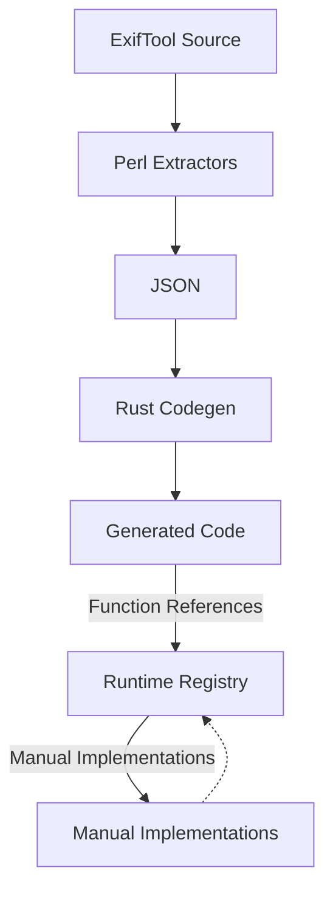

# ExifTool Integration: Code Generation & Implementation

**🚨 CRITICAL: All integration follows [TRUST-EXIFTOOL.md](TRUST-EXIFTOOL.md) - we translate ExifTool exactly, never innovate.**

**⚠️ MANUAL PORTING BANNED**: We've had 100+ bugs from manual transcription of ExifTool data. All ExifTool data MUST be extracted automatically.

This document describes the complete system for integrating ExifTool's metadata extraction capabilities into exif-oxide through automated code generation and manual implementations.

## Overview

The ExifTool integration system uses a hybrid approach combining automated code generation with targeted manual implementations:

### Generated Components

- **Tag tables** with runtime conversion references
- **Lookup tables** from manufacturer modules (Canon white balance, Nikon lenses, etc.)
- **File type detection** patterns and discriminated unions
- **Reference lists** showing what manual implementations are needed

### Manual Components

- **Conversion functions** (PrintConv/ValueConv) with complex logic
- **Manufacturer processors** for binary data parsing
- **Encryption/decryption** algorithms
- **Format handlers** for variable-length data structures

**Core Principle**: Generated code provides data and structure; manual code provides ExifTool-equivalent logic. Complex logic is never generated - it's faithfully translated from ExifTool source.

## System Architecture



### Build System

```
codegen/
├── src/                 # Rust orchestration (simplified architecture)
│   ├── main.rs         # Command-line interface and coordination
│   ├── discovery.rs    # Auto-discovery of module directories
│   ├── config/         # Configuration management
│   ├── extraction.rs   # Calls Perl extractors with explicit arguments
│   ├── patching.rs     # Atomic ExifTool patching with tempfile
│   ├── file_operations.rs # Atomic file I/O operations
│   ├── table_processor.rs # Table processing and validation
│   └── generators/     # Rust code generation
│       ├── lookup_tables/ # Lookup table generators (modular output)
│       ├── file_detection/ # File type detection
│       ├── data_sets/   # Boolean set generators
│       ├── tags.rs     # Tag table generator (semantic grouping)
│       └── composite_tags.rs # Composite tag generator
├── config/             # Source-file-based configuration
│   ├── Canon_pm/      # Canon.pm extractions
│   │   └── simple_table.json
│   ├── ExifTool_pm/   # ExifTool.pm extractions
│   │   ├── simple_table.json
│   │   ├── file_type_lookup.json
│   │   ├── boolean_set.json
│   │   └── regex_patterns.json
│   ├── Nikon_pm/      # Nikon.pm extractions
│   │   ├── simple_table.json
│   │   └── print_conv.json
│   └── [Other]_pm/    # Auto-discovered modules
├── extractors/        # Simple Perl scripts (explicit arguments)
│   ├── simple_table.pl     # Takes file path + hash name
│   ├── tag_tables.pl       # Tag definitions
│   ├── file_type_lookup.pl # File detection
│   ├── boolean_set.pl      # Boolean sets
│   └── regex_patterns.pl   # Pattern extraction
├── schemas/           # JSON schema validation
└── generated/         # Temporary extraction data (gitignored)
```

### Runtime System

```
src/
├── registry.rs                    # Function lookup registry
├── implementations/               # Manual conversion functions
│   ├── print_conv.rs             # PrintConv implementations
│   ├── value_conv.rs             # ValueConv implementations
│   └── [manufacturer]/          # Specialized processors
├── generated/                     # Generated lookup tables (modular structure)
│   ├── tags/                     # Semantic tag grouping (8 focused modules)
│   │   ├── core.rs               # Core EXIF tags (1,256 lines)
│   │   ├── camera.rs             # Camera-specific tags (376 lines)
│   │   ├── gps.rs                # GPS-related tags (365 lines)
│   │   ├── time.rs               # Time-related tags (123 lines)
│   │   ├── author.rs             # Author/copyright tags (46 lines)
│   │   ├── special.rs            # Special/mixed-group tags (46 lines)
│   │   ├── common.rs             # Shared types (33 lines)
│   │   └── mod.rs                # Re-exports and unified interface
│   ├── Canon_pm/                 # Canon.pm extractions (functional splitting)
│   │   ├── canonimagesize.rs     # Image size lookup
│   │   ├── canonwhitebalance.rs  # White balance lookup
│   │   ├── canonmodelid.rs       # Model ID lookup
│   │   ├── canonquality.rs       # Quality lookup
│   │   ├── picturestyles.rs      # Picture styles lookup
│   │   └── mod.rs                # Re-exports all Canon tables
│   ├── ExifTool_pm/              # ExifTool.pm extractions (6 functional modules)
│   │   ├── mimetype.rs           # MIME type lookup
│   │   ├── filetypeext.rs        # File type extension lookup
│   │   ├── weakmagic.rs          # Weak magic patterns
│   │   ├── createtypes.rs        # Create types
│   │   ├── processtype.rs        # Process types
│   │   ├── ispc.rs               # IsPC checks
│   │   └── mod.rs                # Re-exports all ExifTool tables
│   ├── XMP_pm/                   # XMP.pm extractions (5 functional modules)
│   │   ├── nsuri.rs              # Namespace URI lookup
│   │   ├── xmpns.rs              # XMP namespace lookup
│   │   ├── charname.rs           # Character name lookup
│   │   ├── charnum.rs            # Character number lookup
│   │   ├── stdxlatns.rs          # Standard translation namespace
│   │   └── mod.rs                # Re-exports all XMP tables
│   ├── Nikon_pm/                 # Nikon.pm extractions (including static arrays)
│   │   ├── nikonlensids.rs       # Lens ID lookup
│   │   ├── xlat_0.rs             # XLAT encryption array [0] (256 bytes)
│   │   ├── xlat_1.rs             # XLAT encryption array [1] (256 bytes)  
│   │   └── mod.rs                # Re-exports all Nikon tables and arrays
│   ├── Exif_pm/                  # Exif.pm extractions
│   │   ├── orientation.rs        # Orientation lookup
│   │   └── mod.rs                # Re-exports all Exif tables
│   ├── PNG_pm/                   # PNG.pm extractions (3 functional modules)
│   │   ├── isdatchunk.rs         # IsDatChunk checks
│   │   ├── istxtchunk.rs         # IsTxtChunk checks
│   │   ├── noleapfrog.rs         # NoLeapFrog checks
│   │   └── mod.rs                # Re-exports all PNG tables
│   └── file_types/               # File type detection
│       ├── file_type_lookup.rs   # File type lookup
│       ├── magic_number_patterns.rs # Magic number patterns
│       └── mod.rs                # Re-exports all file type tables
└── processor_registry/           # Advanced processor architecture
    ├── traits.rs                # BinaryDataProcessor trait
    └── capability.rs            # Capability assessment
```

## Config Philosophy

**CRITICAL**: Configuration files specify **WHAT** to extract, not extracted data itself.

### Simple Config Principle

**✅ CORRECT** - Simple declarative config (10-20 lines):
```json
{
  "extractor": "tag_kit.pl",
  "source": "third-party/exiftool/lib/Image/ExifTool/Canon.pm",
  "description": "Canon camera tag definitions",
  "tables": [
    {
      "table_name": "CameraSettings",
      "description": "Canon camera settings with inline PrintConv"
    }
  ]
}
```

**❌ WRONG** - Config containing extracted data (100+ lines):
```json
{
  "tag_kits": [
    {
      "name": "CanonCameraSettings",
      "tags": [
        {"tag_id": "1", "name": "MacroMode", "format": "int16s"},
        {"tag_id": "2", "name": "SelfTimer", "format": "int16s"},
        // ... 500+ more lines of extracted data
      ]
    }
  ]
}
```

### Architecture Flow

**Correct**: Config → Extractor → Generated Code
1. **Simple config** specifies tables to extract
2. **Extractor** runs during `make codegen` 
3. **Generated code** contains the extracted data structures

**Broken**: Config → Extractor → Config → Extractor (circular dependency)
1. Script generates config containing extracted data
2. Config becomes the data source instead of ExifTool
3. Updates require regenerating configs instead of updating source

### Validation Rules

- **Config files should be <100 lines** - if larger, you're doing extraction in config instead of letting extractors do their job
- **Configs should be human-readable and git-diffable** - engineers should understand what's being extracted
- **Configs describe intent** ("extract Canon camera settings"), **not implementation** (actual tag structures)
- **Source of truth remains ExifTool** - configs just point to what to extract

### Tools & Workflow

**Standard Workflow for New Modules**:
1. **Universal Patching**: `./scripts/patch_all_modules.sh` (patches all modules at once)
2. **Config Generation**: `perl scripts/auto_config_gen.pl ../third-party/exiftool/lib/Image/ExifTool/ModuleName.pm`
3. **Code Generation**: `make codegen`

**Individual Tools**:
- `scripts/patch_all_modules.sh` - **Recommended**: Patches all ExifTool modules for symbol table access
- `scripts/auto_config_gen.pl` - Symbol table introspection to generate simple configs (finds ALL tables)
- `scripts/patch_exiftool_modules_universal.pl` - Individual module patching (used by auto_config_gen.pl)
- Expression parser - Handles most conversion logic automatically
- PrintConv/ValueConv registry - Handles exotic conversion cases only

**Key Benefits of Universal Patching**:
- **Complete Discovery**: Finds ALL tag tables (171 tables in Nikon vs ~10 manually)
- **Zero Maintenance**: Once patched, always accessible for symbol table introspection
- **Safe & Reversible**: Only converts top-level `my` to `our`, semantically equivalent
- **Eliminates Manual Errors**: No more missing tables or transcription mistakes

**Remember**: Universal patching + simple configs + powerful extractors = comprehensive, maintainable architecture.

## Daily Development Workflow

### 1. Adding New PrintConv/ValueConv Functions

**Step 1: Identify Need**

```bash
# Test on real images to see what's missing
cargo run -- photo.jpg --show-missing

# Output shows:
# Missing implementations:
# - orientation_print_conv (EXIF:Orientation)
# - canon_wb_lookup (Canon:WhiteBalance)
```

**Step 2: Find ExifTool Source**

```perl
# Located in ExifTool source
%orientation = (
    1 => 'Horizontal (normal)',
    2 => 'Mirror horizontal',
    3 => 'Rotate 180',
    # ...
);
```

**Step 3: Implement Using Generated Tables**

```rust
/// EXIF Orientation PrintConv
/// ExifTool: lib/Image/ExifTool/Exif.pm:281-290 (%orientation hash)
/// Generated table: src/generated/Exif_pm/mod.rs
pub fn orientation_print_conv(val: &TagValue) -> TagValue {
    use crate::generated::Exif_pm::lookup_orientation;

    if let Some(orientation_val) = val.as_u8() {
        if let Some(description) = lookup_orientation(orientation_val) {
            return TagValue::string(description);
        }
    }
    TagValue::string(format!("Unknown ({val})"))
}
```

**Step 4: Register Function**

```rust
// In implementations/mod.rs
pub fn register_all_conversions() {
    registry::register_print_conv("orientation_print_conv", print_conv::orientation_print_conv);
}
```

**Step 5: Test**

```bash
# Verify against ExifTool
exiftool -j test.jpg > expected.json
cargo run -- test.jpg > actual.json
# Compare orientation values
```

### 2. Using Generated Lookup Tables

Generated tables integrate seamlessly with manual functions:

```rust
// Generated: Canon white balance lookup
use crate::generated::Canon_pm::lookup_canon_white_balance;

// Manual: PrintConv function using generated table
pub fn canon_wb_print_conv(value: &TagValue) -> TagValue {
    if let Some(wb) = value.as_u8() {
        if let Some(name) = lookup_canon_white_balance(wb) {
            return TagValue::string(name);
        }
    }
    TagValue::string(format!("Unknown ({value})"))
}
```

### 3. Tag-Specific Registry System + Expression Compiler

The PrintConv/ValueConv system uses a four-tier lookup hierarchy to map tags to their conversion functions:

#### Four-Tier Lookup System (Updated P17)

1. **Module::Tag Lookup** (highest priority)
   - Module-specific implementations for tags that behave differently per manufacturer
   - Example: `Canon_pm::WhiteBalance` → `canon_white_balance_print_conv`

2. **🎉 NEW: Expression Compiler** (automatic compilation)
   - **Compiles most expressions automatically** - no manual registry entries needed
   - **sprintf patterns**: `sprintf("%.1f mm",$val)` → generates `format!("{:.1} mm", val)` directly
   - **ExifTool functions**: `Image::ExifTool::Exif::PrintFNumber($val)` → direct call to `fnumber_print_conv(val)`
   - **Ternary expressions**: `$val >= 0 ? $val : undef` → generates `if val >= 0.0 { val } else { undef }`
   - **String interpolation**: `"$val mm"` → generates `format!("{} mm", val)`

3. **Expression Registry Fallback** (third priority)
   - **Only for non-compilable expressions** - regex operations, power operations (`2 ** x`)
   - Example: `$val =~ /^(inf|undef)$/ ? $val : "$val m"` → `gpsaltitude_print_conv`

4. **Universal Tag Lookup** (fallback)
   - Tags that work the same across all modules
   - Example: `Flash` → `flash_print_conv` (works for all manufacturers)

#### Implementation

**Registry Definition** (`codegen/src/conv_registry.rs`):

```rust
// Tag-specific registry for ComplexHash and other special cases
// Key format: "ModuleName::TagName" or just "TagName" for universal tags
static TAG_SPECIFIC_PRINTCONV: LazyLock<HashMap<&'static str, (&'static str, &'static str)>> = LazyLock::new(|| {
    let mut m = HashMap::new();
    
    // Module-specific tags (highest priority)
    // m.insert("Canon_pm::WhiteBalance", ("crate::implementations::print_conv", "canon_white_balance_print_conv"));
    
    // Universal tags (work across all modules - fallback)
    m.insert("Flash", ("crate::implementations::print_conv", "flash_print_conv"));
    
    m
});
```

**Lookup Function**:

```rust
/// Look up a tag-specific PrintConv in the registry
/// First tries module-specific lookup (Module::Tag), then universal lookup (Tag)
pub fn lookup_tag_specific_printconv(module: &str, tag_name: &str) -> Option<(&'static str, &'static str)> {
    // First try module-specific lookup
    let module_key = format!("{}::{}", module, tag_name);
    if let Some(result) = TAG_SPECIFIC_PRINTCONV.get(module_key.as_str()).copied() {
        return Some(result);
    }
    
    // Then try universal lookup
    TAG_SPECIFIC_PRINTCONV.get(tag_name).copied()
}
```

**Generator Integration** (`codegen/src/generators/tag_kit_modular.rs`):

```rust
// Three-tier lookup system:
// 1. First try tag-specific lookup (works for all tags, not just ComplexHash)
if let Some((module_path, func_name)) = lookup_tag_specific_printconv(module_name, &tag_kit.name) {
    tag_convs_map.insert(tag_id, (module_path.to_string(), func_name.to_string()));
    continue;
}

// 2. Then try expression/manual lookup based on type
match tag_kit.print_conv_type.as_str() {
    "Expression" => { /* lookup by expression */ }
    "Manual" => { /* lookup by manual name */ }
    _ => {}
}
```

#### When to Use Tag-Specific Registry

Add entries to `TAG_SPECIFIC_PRINTCONV` when:

1. **ComplexHash Tags**: Tags marked as "ComplexHash" in ExifTool (like Flash)
2. **Module-Specific Behavior**: Tags that need different handling per manufacturer
3. **Override Standard Expression**: When a tag needs special handling despite having a standard expression
4. **DRY Principle**: Universal tags that work the same across all modules

#### ValueConv Expression System

ValueConv functions convert raw tag values to logical values. The system uses a hybrid approach combining inline code generation for simple arithmetic with custom functions for complex expressions.

**Expression Classification** (`codegen/src/conv_registry.rs`):

```rust
#[derive(Debug, Clone, PartialEq)]
pub enum ValueConvType {
    Compilable,     // Simple arithmetic - generates inline code
    Function,       // Complex logic - uses custom function
}

/// Classify ValueConv expressions for codegen processing
pub fn classify_valueconv_expression(expr: &str) -> ValueConvType {
    use crate::expression_compiler::ExpressionCompiler;
    
    let compiler = ExpressionCompiler::new();
    if compiler.is_compilable(expr) {
        ValueConvType::Compilable  // Generate inline arithmetic
    } else {
        ValueConvType::Function   // Use custom function
    }
}
```

**Arithmetic Expression Compiler** (`codegen/src/expression_compiler.rs`):

The system includes a complete Shunting Yard algorithm implementation that compiles simple arithmetic expressions at codegen time:

```rust
/// Compile arithmetic expressions to inline Rust code
/// Examples: "$val / 8" → "val / 8.0", "($val-104)/8" → "(val - 104.0) / 8.0"
pub fn try_generate_simple_arithmetic(expr: &str) -> Option<String> {
    // Parse expression using Shunting Yard algorithm
    let tokens = self.tokenize_expression(expr)?;
    let rpn = self.shunting_yard(&tokens)?;
    
    // Generate direct arithmetic for simple cases
    if self.is_simple_arithmetic(&rpn) {
        return Some(self.generate_direct_arithmetic(&rpn));
    }
    
    None // Fall back to stack-based evaluation for complex cases
}
```

**Generated Code Examples**:

```rust
// Instead of function call:
0x1234 => divide_8_value_conv(value)

// Generate inline arithmetic:
0x1234 => {
    match value.as_f64() {
        Some(val) => Ok(TagValue::F64(val / 8.0)),
        None => Ok(value.clone()),
    }
}
```

**Expression Categories**:

- **Compilable (12 expressions)**: Simple arithmetic like `$val * 100`, `$val / 8`, `($val-104)/8`
- **Custom Functions (11+ expressions)**: Complex logic like `2 ** (-$val/3)`, `$val ? 10 / $val : 0`

**Benefits of Inline Generation**:

- **Performance**: Direct arithmetic beats function call overhead
- **Maintainability**: No individual functions to maintain for each arithmetic pattern
- **Type Safety**: All generated code uses proper f64 arithmetic with `.0` literals
- **Zero Dependencies**: No runtime parsing or expression evaluation

**Complex ValueConv Registry** (`codegen/src/conv_registry.rs`):

```rust
static VALUECONV_REGISTRY: LazyLock<HashMap<&'static str, (&'static str, &'static str)>> = LazyLock::new(|| {
    let mut m = HashMap::new();
    
    // Complex expressions that need custom functions
    m.insert("2 ** (-$val/3)", ("crate::implementations::value_conv", "power_neg_div_3_value_conv"));
    m.insert("$val ? 10 / $val : 0", ("crate::implementations::value_conv", "reciprocal_10_value_conv"));
    
    // String processing patterns  
    m.insert("$val=~s/ +$//; $val", ("crate::implementations::value_conv", "trim_whitespace_value_conv"));
    
    // GPS coordinate conversion
    m.insert("gpslatitude_value_conv", ("crate::implementations::value_conv", "gps_coordinate_value_conv"));
    
    m
});
```

**How to Add New Patterns**:

1. **Simple arithmetic**: Just add to tag kit config - automatically compiled to inline code
2. **Complex expressions**: Add registry entry and implement custom function in `src/implementations/value_conv.rs`
3. **Regenerate**: Run `make codegen` - expressions automatically become inline code or function names

The system automatically determines whether to generate inline arithmetic or use custom functions based on expression complexity.

### 4. Adding Simple Array Extraction

**Step 1: Add Array Configuration**

```json
// In codegen/config/Nikon_pm/simple_array.json
{
  "description": "Nikon XLAT arrays for encryption/decryption",
  "arrays": [
    {
      "array_name": "xlat[0]",
      "constant_name": "XLAT_0",
      "element_type": "u8",
      "size": 256,
      "description": "First XLAT encryption array"
    },
    {
      "array_name": "xlat[1]", 
      "constant_name": "XLAT_1",
      "element_type": "u8",
      "size": 256,
      "description": "Second XLAT encryption array"
    }
  ]
}
```

**Step 2: Generate and Use**

```bash
# Regenerate code (auto-patches ExifTool modules)
make codegen

# Use in implementation
use crate::generated::Nikon_pm::{XLAT_0, XLAT_1};

// Direct array indexing (fastest)
let decrypted_byte = XLAT_0[encrypted_value as usize];

// Bounds-checked access
if let Some(&decrypted_byte) = XLAT_0.get(encrypted_value as usize) {
    // Safe access
}
```

**Complex Expression Support**: The simple_array extractor handles arbitrary Perl expressions:

- **Indexed arrays**: `xlat[0]`, `xlat[1]`, `rggb[2]`
- **Simple arrays**: `@afPointNames`, `@lensMounts`
- **Complex expressions**: `%widget->payload`, `@{$hash{key}}`

**Validation**: Arrays are validated for byte-perfect accuracy:

```bash
# Perl validation script
perl codegen/scripts/validate_arrays.pl config/Nikon_pm/simple_array.json

# Rust integration tests  
cargo test --test simple_array_integration
```

### 5. Adding Simple Extraction Types

**Step 1: Add to Configuration**

```json
// In codegen/config/Canon_pm/simple_table.json
{
  "description": "Canon.pm simple lookup tables",
  "tables": [
    {
      "hash_name": "%newCanonTable",
      "constant_name": "NEW_CANON_SETTING",
      "key_type": "u8",
      "description": "Canon new setting names"
    }
  ]
}
```

**Step 2: Generate and Use**

```bash
# Regenerate code (auto-patches ExifTool modules)
make codegen

# Use in implementation
use crate::generated::Canon_pm::lookup_new_canon_setting;
```

**Note**: The build system automatically patches ExifTool modules to expose `my`-scoped variables as package variables based on entries in configuration files. No manual patching is required.

## Code Generation System

### Direct Code Generation

The system generates simple, direct Rust code without macros:

```rust
// Generated lookup table using std::sync::LazyLock (no external dependencies)
pub static ORIENTATION: LazyLock<HashMap<u8, &'static str>> = LazyLock::new(|| {
    let mut map = HashMap::new();
    map.insert(1, "Horizontal (normal)");
    map.insert(2, "Mirror horizontal");
    // ... more entries
    map
});

// Generated lookup function
pub fn lookup_orientation(key: u8) -> Option<&'static str> {
    ORIENTATION.get(&key).copied()
}
```

This approach prioritizes:

- **Readability**: Generated code looks like hand-written Rust
- **Debuggability**: Stack traces point to real code, not macro expansions
- **IDE Support**: Autocomplete and go-to-definition work perfectly
- **Simplicity**: No macro expertise needed to understand or modify

### Extraction Types

The system supports three extraction patterns:

#### Simple Tables

```perl
# Basic key-value lookups
%canonWhiteBalance = (
    0 => 'Auto',
    1 => 'Daylight',
    2 => 'Cloudy',
);
```

#### Regex Patterns

```perl
# File type magic numbers (may contain non-UTF-8 bytes)
%magicNumber = (
    JPEG => '\xff\xd8\xff',
    PNG  => '\x89PNG\r\n\x1a\n',
    BPG  => 'BPG\xfb',  # Contains raw byte 0xFB
);
```

#### File Type Lookup

```perl
# Discriminated unions with aliases
%fileTypeLookup = (
    JPEG => { Description => 'JPEG image', Format => 'JPEG' },
    JPG  => 'JPEG',  # Alias
);
```

### Generated Code Benefits

- **Type Safety**: Proper Rust types for all keys
- **Performance**: LazyLock HashMap lookups with direct generation
- **Simplicity**: No macro complexity - generated code is plain Rust
- **Debugging**: Easy to read and debug generated functions
- **Traceability**: Every entry references ExifTool source
- **Maintenance**: Automatic updates with ExifTool releases
- **Integration**: Seamless use in manual functions via clean imports
- **Scalability**: Modular structure with semantic grouping and functional splitting
- **Binary Safety**: Proper handling of non-UTF-8 bytes in patterns
- **Minimal Dependencies**: Uses std::sync::LazyLock, no external crates for core functionality

### Extractor Selection Guide

The codegen system includes multiple specialized extractors, each serving a specific purpose. Following the "one-trick pony" principle, each extractor excels at one type of extraction.

#### Tag-Related Extractors

**Primary Extractor (Use This)**:
- **`tag_kit.pl`** - Extracts complete tag definitions with embedded PrintConv implementations
  - Purpose: Create self-contained "tag kits" with everything needed to process a tag
  - Target: Any ExifTool tag table (EXIF, GPS, manufacturer-specific)
  - Output: Tag ID, name, format, groups, AND PrintConv data together
  - Benefit: Eliminates tag ID/PrintConv mismatch bugs
  - Note: Extracts ALL tags including those marked `Unknown => 1` (which we filter during runtime)

**Deprecated Extractors (Being Replaced by Tag Kit)**:
- **`inline_printconv.pl`** - ⚠️ DEPRECATED - Extracts PrintConv hashes from tag definitions
  - Being replaced: Tag kit extracts the same data as part of complete bundles
- **`tag_tables.pl`** - ⚠️ DEPRECATED - Hardcoded to extract only EXIF/GPS tags
  - Being replaced: Tag kit is config-driven and works with any module
- **`tag_definitions.pl`** - ⚠️ DEPRECATED - Extracts tags with frequency filtering
  - Being replaced: Tag kit provides complete bundles instead of function references

#### Static Array Extractors

- **`simple_array.pl`** ⭐ - Extracts static arrays for performance-critical operations
  - Purpose: Direct array indexing for cryptographic operations and large lookups
  - Example: Nikon XLAT encryption arrays, AF point name arrays
  - When to use: **Always** for ExifTool arrays needing direct indexing vs key-value lookup
  - Features: Complex expression support (`xlat[0]`, `%widget->payload`), byte-perfect accuracy
  - Output: Static Rust arrays (`[u8; 256]`) with O(1) direct access

#### Lookup Table Extractors

- **`simple_table.pl`** - Extracts standalone key-value lookup tables
  - Purpose: Static lookups not associated with specific tags
  - Example: Canon white balance names, Nikon lens IDs
  - When to use: Manufacturer-specific lookup tables referenced by multiple tags

- **`boolean_set.pl`** - Extracts boolean membership sets
  - Purpose: Fast membership testing (hash keys mapping to 1)
  - Example: `if ($isDatChunk{$chunk})`
  - When to use: ExifTool sets used for existence checks

#### Binary Data Extractors

- **`process_binary_data.pl`** - Extracts ProcessBinaryData table structures
  - Purpose: Binary data parsing table definitions
  - Target: Tables with `%binaryDataAttrs`
  - Output: Offset, format, and tag information for binary parsing

- **`runtime_table.pl`** - Generates runtime HashMap creation code
  - Purpose: Tables requiring runtime context (camera model, firmware)
  - Target: ProcessBinaryData tables with conditional logic
  - Output: Functions that create HashMaps at runtime

#### Specialized Extractors

- **`composite_tags.pl`** - Extracts composite tag definitions
  - Purpose: Tags calculated from other tags
  - Features: Dependencies, expressions, requirements

- **`conditional_tags.pl`** - Extracts complex conditional tag arrays
  - Purpose: Model/firmware-specific tag variations
  - Features: Condition parsing, count/format detection

- **`file_type_lookup.pl`** - Extracts file type detection structures
  - Purpose: File format identification
  - Output: Discriminated unions with aliases

- **`regex_patterns.pl`** - Extracts magic number patterns
  - Purpose: Binary file signature detection
  - Features: Non-UTF-8 byte handling

- **`model_detection.pl`** - Extracts camera model patterns
  - Purpose: Model-specific behavior detection

- **`offset_patterns.pl`** - Extracts offset calculation patterns
  - Purpose: Sony-specific complex offset schemes

- **`tag_table_structure.pl`** - Extracts manufacturer table structures
  - Purpose: Generate Rust enums for manufacturer tables

#### Quick Decision Guide

1. **Extracting tags with their PrintConvs?** → Use `tag_kit.pl`
2. **Extracting static arrays for direct indexing?** → Use `simple_array.pl` ⭐ 
3. **Extracting standalone lookup tables?** → Use `simple_table.pl`
4. **Extracting binary data structures?** → Use `process_binary_data.pl`
5. **Need runtime HashMap creation?** → Use `runtime_table.pl`
6. **Extracting boolean sets?** → Use `boolean_set.pl`
7. **Extracting composite tags?** → Use `composite_tags.pl`

For detailed extractor comparisons and examples, see [EXTRACTOR-GUIDE.md](../reference/EXTRACTOR-GUIDE.md).

### Non-UTF-8 Data Handling

The code generation system properly handles non-UTF-8 bytes found in ExifTool's binary patterns:

#### Pattern Escaping

The `escape_pattern_for_rust` function ensures all patterns are valid Rust string literals:

```rust
// Handles non-UTF-8 bytes like 0xFB in BPG magic number
fn escape_pattern_for_rust(pattern: &str) -> String {
    let mut escaped = String::new();

    for byte in pattern.bytes() {
        match byte {
            b'\\' => escaped.push_str("\\\\"),
            b'"' => escaped.push_str("\\\""),
            b'\n' => escaped.push_str("\\n"),
            b'\r' => escaped.push_str("\\r"),
            b'\t' => escaped.push_str("\\t"),
            // Non-ASCII or control characters become \xNN
            0x00..=0x1F | 0x7F..=0xFF => {
                escaped.push_str(&format!("\\x{:02x}", byte));
            }
            _ => escaped.push(byte as char),
        }
    }
    escaped
}
```

#### JSON Cleaning

When extracting patterns from ExifTool that contain raw bytes:

1. Perl extracts the data (may contain non-UTF-8)
2. Rust detects and cleans problematic bytes in JSON
3. Patterns are properly escaped for Rust string literals
4. Generated code contains valid UTF-8 with escape sequences

Example: BPG magic number `BPG\xfb` becomes `"BPG\\xfb"` in generated Rust code.

### Build Pipeline

The simplified build pipeline uses Rust orchestration with simple Perl scripts:

1. **Auto-discovery**: Rust scans `codegen/config/` directories for modules
2. **Configuration**: Each module has JSON configs with explicit `source` paths
3. **Patching**: Rust uses atomic file operations to temporarily patch ExifTool modules
4. **Extraction**: Rust calls Perl scripts with explicit file paths and hash names
5. **Generation**: Creates modular Rust code directly from individual JSON files
6. **Cleanup**: Makefile reverts ExifTool patches using git checkout

```bash
# Full pipeline
make codegen              # Complete build with schema validation
make -j4 codegen         # Parallel execution (faster)

# Development commands
make check-schemas       # Validate all configuration files
cd codegen && cargo run --release  # Run code generation directly

# Single config debugging (extraction + generation)
cd codegen && cargo run -- config/Canon_pm/simple_table.json    # Debug specific config
cd codegen && RUST_LOG=debug cargo run -- config/Module_pm/config.json  # Verbose debug output
```

#### Architecture Improvements

**Old System** (pre-July 2025):

- Complex Makefile with parallel extraction logic
- Perl scripts read JSON configs and knew about structure
- Combined extraction → split-extractions → individual files
- Hardcoded module lists in Rust main.rs
- Path guessing logic for ExifTool modules

**New System** (July 2025):

- **Rust orchestrates everything** - Single `cargo run` handles full pipeline
- **Simple Perl scripts** - Take explicit file paths and hash names as arguments
- **Direct JSON output** - No split-extractions step needed
- **Auto-discovery** - Scans config directories, no hardcoded module lists
- **Atomic file operations** - Uses tempfile crate for safe ExifTool patching
- **Modular generated code** - Semantic grouping and functional splitting
- **Explicit source paths** - No path guessing, all configured in JSON

#### Why Patching is Required

ExifTool uses `my`-scoped lexical variables for many lookup tables (e.g., `my %canonWhiteBalance`). These variables are private to their module and cannot be accessed by external scripts. To extract these tables programmatically, we need to convert them to package variables (`our %canonWhiteBalance`) which are accessible via the symbol table.

**Patching Implementation**: Rust handles patching with atomic file operations:

- **Auto-discovery**: Reads all configurations to identify required variables per module
- **Streaming replacement**: Uses `tempfile::NamedTempFile::new_in()` for same-filesystem temp files
- **Atomic operations**: `temp_file.persist()` ensures safe replacement
- **Targeted patching**: Only patches variables actually needed by configurations
- **Safe cleanup**: Makefile uses `git checkout` to revert patches after generation
- **Error handling**: Graceful fallback if patching fails for specific variables

## Manual Implementation System

### Runtime Registry

The system uses function-name based registration avoiding code generation overhead:

```rust
// Zero-cost function lookup
static GLOBAL_REGISTRY: LazyLock<Arc<RwLock<Registry>>> =
    LazyLock::new(|| Arc::new(RwLock::new(Registry::new())));

// O(1) dispatch
pub fn apply_print_conv(fn_name: &str, value: &TagValue) -> TagValue {
    if let Some(func) = GLOBAL_REGISTRY.read().unwrap().get_print_conv(fn_name) {
        func(value)
    } else {
        TagValue::string(format!("Unknown ({value})"))  // Graceful fallback
    }
}
```

### Function Patterns

#### PrintConv: Logical → Display

```rust
pub fn flash_print_conv(val: &TagValue) -> TagValue {
    // Returns TagValue for precise JSON control
    if let Some(flash_val) = val.as_u16() {
        // Complex flash decode logic from ExifTool
        TagValue::string(format_flash_description(flash_val))
    } else {
        TagValue::string(format!("Unknown ({val})"))
    }
}
```

#### ValueConv: Raw → Logical

```rust
pub fn fnumber_value_conv(val: &TagValue) -> Result<TagValue> {
    // Returns Result for error handling
    match val {
        TagValue::Rational(num, den) if *den != 0 => {
            Ok(TagValue::F64(*num as f64 / *den as f64))
        }
        _ => Ok(val.clone()),
    }
}
```

### Manufacturer Processors

Complex manufacturer-specific processing uses modular architecture:

```rust
// Canon module structure
src/implementations/canon/
├── af_info.rs          # AF Info processing
├── binary_data.rs      # Binary data extraction
├── offset_schemes.rs   # Offset detection
├── tags.rs             # Tag name resolution
└── tiff_footer.rs      # TIFF footer handling

// Example: Variable-length processing
pub fn process_canon_af_info(
    exif_reader: &mut crate::exif::ExifReader,
    data: &[u8],
) -> Result<()> {
    // ExifTool: lib/Image/ExifTool/Canon.pm AFInfo processing
    let mut offset = 0;

    // Extract size for variable-length array
    let af_info_size = u16::from_be_bytes([data[offset], data[offset + 1]]);
    offset += 2;

    // Process based on size - exact ExifTool translation
    // ... complex parsing logic

    Ok(())
}
```

## Advanced Processor Architecture

For ExifTool's 121+ ProcessBinaryData variants, the system provides a trait-based architecture:

### Capability Assessment

```rust
pub trait BinaryDataProcessor {
    fn assess_capability(&self, context: &ProcessorContext) -> ProcessorCapability;
    fn process(&self, context: &mut ProcessorContext) -> Result<()>;
}

pub enum ProcessorCapability {
    Perfect,      // Exact match - use this processor
    Good,         // Compatible but not optimal
    Fallback,     // Can handle but suboptimal
    Incompatible, // Cannot process
}
```

### Context-Rich Processing

```rust
pub struct ProcessorContext {
    pub tag_table: String,
    pub processor_name: String,
    pub data: Vec<u8>,
    pub metadata: HashMap<String, String>,
    pub exif_reader: &mut ExifReader,
}

// Example processor
impl BinaryDataProcessor for CanonCameraSettingsProcessor {
    fn assess_capability(&self, context: &ProcessorContext) -> ProcessorCapability {
        if context.tag_table == "Canon::Main" &&
           context.processor_name == "ProcessBinaryData" {
            ProcessorCapability::Perfect
        } else {
            ProcessorCapability::Incompatible
        }
    }
}
```

## System Extension

### Adding New Generator Types

For new ExifTool data patterns (like XMP namespaces):

1. **Create Perl Extractor**: `extractors/xmp_namespaces.pl`
2. **Add Input Schema**: `schemas/input.rs`
3. **Create Generator**: `generators/xmp_namespaces.rs`
4. **Wire into Main**: `main.rs`

The modular architecture makes extension straightforward.

### Error Handling

The system uses `thiserror` for idiomatic error management:

```rust
#[derive(Error, Debug)]
pub enum ExifError {
    #[error("IO error: {0}")]
    Io(#[from] std::io::Error),

    #[error("Invalid file format: {0}")]
    InvalidFormat(String),

    #[error("Registry error: {0}")]
    Registry(String),
}

pub type Result<T> = std::result::Result<T, ExifError>;
```

## Maintenance & Updates

### ExifTool Version Updates

```bash
# Update submodule to new ExifTool version
cd third-party/exiftool && git checkout v12.XX

# Regenerate all code
make codegen

# Test compatibility
cargo test

# Most updates require no manual intervention
```

### Build System Capabilities

The simplified build system supports efficient development:

```bash
# Parallel execution (faster development)
make -j4 codegen

# Direct Rust execution (for debugging)
cd codegen && cargo run --release

# Schema validation
make check-schemas

# Syntax checking
make check-perl

# Clean generated files
make clean
```

## Complete Command Reference

### Generation

```bash
make codegen              # Full pipeline with schema validation
make -j4 codegen         # Parallel execution
cd codegen && cargo run --release  # Direct Rust execution
make check-schemas       # Validate configuration files
```

### Development

```bash
cargo run -- image.jpg --show-missing  # Find missing implementations
cargo run -- image.jpg > actual.json   # Test output
exiftool -j image.jpg > expected.json  # Reference output
```

### Testing

```bash
cargo test               # Full test suite
make compat-test        # ExifTool compatibility
make precommit          # Full validation including schema checks
```

### Incremental

```bash
make clean              # Clean all generated files
make check-perl         # Check Perl script syntax
```

## Performance Characteristics

### Generated Code

- **Zero Runtime Cost**: LazyLock static tables with HashMap lookups
- **Type Safety**: Compile-time validation of all keys and values
- **Memory Efficiency**: Shared string literals, no duplication

### Manual Implementation

- **O(1) Function Dispatch**: HashMap-based registry lookup
- **Minimal Overhead**: Direct function calls after lookup
- **Graceful Degradation**: Never panics on missing implementations

### Build System

- **Parallel Extraction**: Multiple Perl extractors run concurrently
- **Incremental Updates**: Only regenerate changed components
- **Fast Iteration**: Simple table changes rebuild in seconds

## Anti-Patterns: What NOT to Do

### 🚨 NEVER Manual Port ExifTool Data

**Problem**: We've had **100+ bugs** from manual transcription of ExifTool data. Manual porting is a nightmare to debug.

**Why Manual Porting Always Fails**:
- **Transcription errors**: Missing entries, typos in hex values, wrong magic numbers
- **Missing edge cases**: ExifTool handles special values (e.g. -1 = "n/a") that manual ports miss  
- **Version drift**: ExifTool releases monthly, manual ports become stale immediately
- **Silent failures**: Wrong lens IDs/white balance modes fail only on specific camera models

**Examples of Real Bugs**:

```perl
# ExifTool source (correct)
%canonWhiteBalance = (
    0 => 'Auto', 1 => 'Daylight', 2 => 'Cloudy', 
    3 => 'Tungsten', 4 => 'Fluorescent', 5 => 'Flash', 9 => 'Custom'
);
```

```rust
// ❌ BANNED - Manual port with missing entries
match wb_value {
    0 => "Auto", 1 => "Daylight", 2 => "Cloudy", 3 => "Tungsten",
    // Missing: 4 => "Fluorescent", 5 => "Flash", 9 => "Custom" 
    _ => "Unknown", // Silent failure for missing modes
}

// ❌ BANNED - Magic number typos  
0x0003 => "EF 35-80mm f/4-5.6",  // Should be 0x0004 - wrong lens name
```

**Required Approach**:

```rust
// ✅ REQUIRED - Use generated lookup tables
use crate::generated::Canon_pm::lookup_canon_white_balance;
if let Some(wb_name) = lookup_canon_white_balance(wb_value) {
    TagValue::string(wb_name)  // Zero transcription errors, auto-updates
}
```

**Enforcement**: All PRs containing manually transcribed ExifTool data will be **REJECTED**. Use codegen instead.

### ⚠️ NEVER Add Extraction Timestamps

**Problem**: Generators must not include runtime timestamps in generated code comments.

**Why This is Prohibited**: 
- Timestamps change on every codegen run, even when the actual extracted data is unchanged
- Creates spurious git diffs that hide real changes to generated code  
- Makes it impossible to use `git diff` to track meaningful changes
- Wastes developer time reviewing meaningless timestamp-only diffs

**Examples of Banned Patterns**:

```rust
// ❌ BANNED - Creates spurious git diffs
//! Extracted at: Wed Jul 23 17:15:51 2025 GMT

// ❌ BANNED - Same problem with different format  
//! Generated on: 2025-07-23 17:15:51 UTC

// ❌ BANNED - Any volatile timestamp
code.push_str(&format!("//! Timestamp: {}", source.extracted_at));
```

**Correct Approach**:

```rust
// ✅ GOOD - Useful source information without volatile data
//! Generated from: Canon.pm table: canonWhiteBalance
//! 
//! DO NOT EDIT MANUALLY - changes will be overwritten.
```

**Message for Engineers of Tomorrow**: This anti-pattern has been removed multiple times because engineers assume timestamps are "helpful metadata." They are not. They actively harm the development workflow by making `git diff` unreliable for tracking real changes. Any PR that adds extraction timestamps will be rejected.

## Current Capabilities

- **50+ Conversion Functions**: Core EXIF, GPS, and manufacturer PrintConv/ValueConv
- **Canon Support**: AF info, binary data, offset schemes, TIFF footer processing
- **Nikon Support**: AF processing, encryption, lens database, IFD handling, XLAT arrays
- **Sony Support**: Basic manufacturer-specific processing
- **File Detection**: Magic number patterns, MIME types, extension lookup
- **Generated Integration**: Source-file-based organization with functional splitting
- **Runtime Registry**: Zero-overhead function dispatch with graceful fallbacks  
- **Scalable Architecture**: Modular code generation supporting 300+ lookup tables
- **Semantic Organization**: Tags grouped by logical categories (core, camera, GPS, etc.)
- **Build Performance**: Smaller files improve IDE response and compilation speed
- **Static Array Framework**: Direct array indexing for cryptographic operations with byte-perfect accuracy

## Related Documentation

- [API-DESIGN.md](API-DESIGN.md) - Public API structure and TagValue design
- [PROCESSOR-DISPATCH.md](../guides/PROCESSOR-DISPATCH.md) - Advanced processor dispatch
- [GETTING-STARTED.md](../GETTING-STARTED.md) - Practical implementation guide  
- [ARCHITECTURE.md](../ARCHITECTURE.md) - High-level system overview
