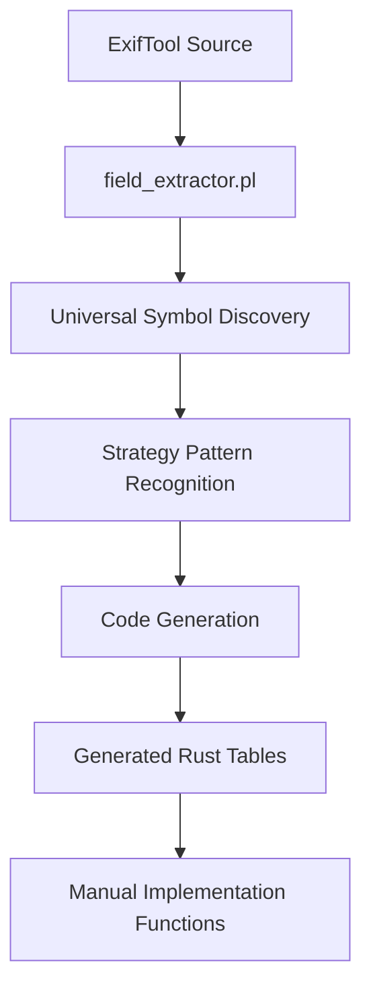

# ExifTool Integration: Code Generation & Implementation

**🚨 CRITICAL: All integration follows [TRUST-EXIFTOOL.md](TRUST-EXIFTOOL.md) - we translate ExifTool exactly, never innovate.**

**⚠️ MANUAL PORTING BANNED**: We've had 100+ bugs from manual transcription of ExifTool data. All ExifTool data MUST be extracted automatically.

**🚨 READ FIRST**: [ANTI-PATTERNS.md](ANTI-PATTERNS.md) - Critical mistakes that cause PR rejections

## 🚨 STOP: READ THIS BEFORE ANY PPI/EXPRESSION WORK 🚨

**WE'VE HAD 5+ EMERGENCY RECOVERIES** from engineers who ignored these warnings and committed "architectural vandalism" that broke the entire PPI system. **Your PR WILL BE REJECTED** if you violate these patterns.

**SPECIFIC VIOLATIONS THAT CAUSE IMMEDIATE REJECTION**:
- `split_whitespace()` on AST nodes → **BANNED** - destroys type safety 
- Deleting pattern recognition code → **BANNED** - breaks real camera files
- `args[N].starts_with()` on stringified AST → **BANNED** - violates visitor pattern
- Manual transcription of ExifTool data → **BANNED** - causes silent bugs
- Inconsistent binary operations handling → **BANNED** - breaks expression architecture

**READ**: [P07-emergency-ppi-recovery.md](todo/P07-emergency-ppi-recovery.md) shows what happens when these rules are ignored - 546 lines of critical ExifTool patterns were deleted, requiring emergency system recovery.

## 5 Critical Principles

Before touching any code, understand these principles that prevent architectural vandalism:

1. **Trust ExifTool** - Translate exactly, never manually port or "improve" ExifTool logic
2. **Use Strategy Pattern** - Current system auto-discovers symbols, no config files needed
3. **Use AST Patterns** - Work with structured data, never stringify and re-parse
4. **Use Generated Tables** - Import from `src/generated/`, never manually transcribe
5. **Generated Code is Read-Only** - Fix generators in `codegen/src/`, never edit `src/generated/**/*.rs`

## System Overview

The ExifTool integration uses a **unified strategy-based architecture** that automatically discovers and processes ExifTool data:

### How It Works



**Key Benefits:**
- **🔍 Complete Discovery**: Finds ALL symbols automatically, no configuration needed
- **⚡ Zero Setup**: New modules work immediately
- **🧩 Pattern Recognition**: Smart classification of symbol types
- **🎯 Focused Output**: Generates only what you need

### Generated vs Manual Code

**Generated Code** (`src/generated/`):
- Lookup tables (Canon white balance, Nikon lens IDs, etc.)
- Tag definitions with metadata
- File type detection patterns
- Binary data structures

**Manual Code** (`src/implementations/`):
- PrintConv/ValueConv functions with complex logic
- Manufacturer-specific processors
- Binary data parsing algorithms

## Daily Development Workflow

### Adding PrintConv/ValueConv Functions

**Step 1: Identify Missing Function**
```bash
# Test to see what's missing
cargo run -- photo.jpg --show-missing

# Output shows:
# Missing implementations:
# - orientation_print_conv (EXIF:Orientation)
# - canon_wb_print_conv (Canon:WhiteBalance)
```

**Step 2: Check for Generated Table**
```bash
# Strategy system auto-generates lookup tables
find src/generated -name "*orientation*" -o -name "*white_balance*"
```

**Step 3: Implement Using Generated Table**
```rust
/// EXIF Orientation PrintConv
/// ExifTool: lib/Image/ExifTool/Exif.pm:281-290 (%orientation hash)
pub fn orientation_print_conv(val: &TagValue) -> TagValue {
    use crate::generated::exif::lookup_orientation;

    if let Some(orientation_val) = val.as_u8() {
        if let Some(description) = lookup_orientation(orientation_val) {
            return TagValue::string(description);
        }
    }
    TagValue::string(format!("Unknown ({val})"))
}
```

**Step 4: Register Function**
```rust
// In implementations/mod.rs
pub fn register_all_conversions() {
    registry::register_print_conv("orientation_print_conv", print_conv::orientation_print_conv);
}
```

**Step 5: Test Against ExifTool**
```bash
# Verify output matches
exiftool -j test.jpg > expected.json
cargo run -- test.jpg > actual.json
# Compare orientation values
```

### Using Generated Lookup Tables

Generated tables integrate seamlessly with manual functions:

```rust
// Generated: Canon white balance lookup
use crate::generated::Canon_pm::lookup_canon_white_balance;

// Manual: PrintConv function using generated table
pub fn canon_wb_print_conv(value: &TagValue) -> TagValue {
    if let Some(wb) = value.as_u8() {
        if let Some(name) = lookup_canon_white_balance(wb) {
            return TagValue::string(name);
        }
    }
    TagValue::string(format!("Unknown ({value})"))
}
```

### Function Registry System

The system uses a four-tier lookup hierarchy:

1. **Module-specific** (highest priority): `Canon_pm::WhiteBalance` → `canon_white_balance_print_conv`
2. **Expression Compiler**: Automatic compilation of sprintf, ternary, interpolation patterns
3. **Expression Registry**: Fallback for complex patterns (regex, power operations)
4. **Universal Tags**: Same function across all manufacturers

```rust
// Add to registry for special cases
static TAG_SPECIFIC_PRINTCONV: LazyLock<HashMap<&'static str, (&'static str, &'static str)>> = LazyLock::new(|| {
    let mut m = HashMap::new();
    
    // Module-specific behavior
    m.insert("Canon_pm::WhiteBalance", ("crate::implementations::print_conv", "canon_white_balance_print_conv"));
    
    // Universal tags
    m.insert("Flash", ("crate::implementations::print_conv", "flash_print_conv"));
    
    m
});
```

## Build Commands

### Primary Commands
```bash
make codegen                    # Full pipeline - processes all modules automatically
cd codegen && cargo run --release  # Direct execution with debug output
make clean                      # Clean generated files
```

### Development & Debugging
```bash
cd codegen && RUST_LOG=debug cargo run     # Verbose strategy selection logs
cd codegen && cargo run -- --module Canon  # Process single module
make check-perl                             # Validate Perl scripts
```

### Testing
```bash
cargo test                      # Full test suite
make compat-test               # ExifTool compatibility tests
make precommit                 # Full validation before commit
```

## Generated Code Structure

The system organizes generated code into focused modules:

```
src/generated/
├── Canon_pm/                  # Canon-specific tables
│   ├── white_balance.rs       # White balance lookup
│   ├── lens_types.rs          # Lens type lookup
│   └── mod.rs                 # Re-exports
├── Nikon_pm/                  # Nikon-specific tables
│   ├── lens_ids.rs            # Lens ID lookup
│   ├── xlat_arrays.rs         # Encryption arrays
│   └── mod.rs                 # Re-exports
├── file_types/                # File detection
│   ├── magic_numbers.rs       # Binary signatures
│   └── file_type_lookup.rs    # Type discrimination
└── tags/                      # Semantic grouping
    ├── core.rs                # Core EXIF tags
    ├── gps.rs                 # GPS tags
    └── camera.rs              # Camera settings
```

### Generated Code Example

```rust
// Generated lookup table using std::sync::LazyLock
pub static ORIENTATION: LazyLock<HashMap<u8, &'static str>> = LazyLock::new(|| {
    let mut map = HashMap::new();
    map.insert(1, "Horizontal (normal)");
    map.insert(2, "Mirror horizontal");
    map.insert(3, "Rotate 180");
    // ... more entries from ExifTool
    map
});

// Generated lookup function
pub fn lookup_orientation(key: u8) -> Option<&'static str> {
    ORIENTATION.get(&key).copied()
}
```

## Common Implementation Patterns

### PrintConv: Logical → Display
```rust
pub fn flash_print_conv(val: &TagValue) -> TagValue {
    if let Some(flash_val) = val.as_u16() {
        // Complex flash decode logic from ExifTool
        TagValue::string(format_flash_description(flash_val))
    } else {
        TagValue::string(format!("Unknown ({val})"))
    }
}
```

### ValueConv: Raw → Logical
```rust
pub fn fnumber_value_conv(val: &TagValue) -> Result<TagValue> {
    match val {
        TagValue::Rational(num, den) if *den != 0 => {
            Ok(TagValue::F64(*num as f64 / *den as f64))
        }
        _ => Ok(val.clone()),
    }
}
```

### Using Generated Arrays
```rust
// For encryption/decryption using generated arrays
use crate::generated::Nikon_pm::{XLAT_0, XLAT_1};

pub fn decrypt_nikon_data(data: &[u8], key: u8) -> Vec<u8> {
    let xlat = if key & 1 == 0 { &XLAT_0 } else { &XLAT_1 };
    data.iter().map(|&byte| xlat[byte as usize]).collect()
}
```

## 🚨 Pre-Commit Validation: Avoid PR Rejection 🚨

**RUN THESE COMMANDS BEFORE SUBMITTING ANY PR** to avoid architectural vandalism rejection:

```bash
# Check for banned AST string parsing patterns (MUST return empty)
rg "split_whitespace|\.join.*split|args\[.*\]\.starts_with" codegen/src/ppi/
# If this finds matches: YOUR PR WILL BE REJECTED

# Check for inconsistent binary operations handling (MUST return empty)
rg "if.*=~.*Regexp::(Match|Substitute)" codegen/src/ppi/rust_generator/generator.rs
# If this finds matches: YOUR PR WILL BE REJECTED

# Check for pattern matching that should be in expression handlers
rg "children\[.*\]\.class.*==.*Operator.*=~" codegen/src/ppi/rust_generator/
# Binary operations must go through ExpressionCombiner, not process_node_sequence

# Check for disabled infrastructure (MUST return empty) 
rg "DISABLED|TODO.*normalize|//.*normalize" codegen/src/ppi/rust_generator/mod.rs
# If this finds disabled code: ENABLE PROPERLY, don't disable working systems

# Check for manual ExifTool data (SCAN for hardcoded tables)
rg "match.*=>" src/implementations/ | grep -E "0x[0-9a-f]+ =>"
# Hand-transcribed lookup tables are BANNED - use generated tables instead
```

**If any of these checks fail, fix the issues BEFORE submitting your PR.**

## Troubleshooting

### Build Failures
```bash
# Check Perl syntax
make check-perl

# Debug strategy selection
cd codegen && RUST_LOG=trace cargo run

# Clean and rebuild
make clean && make codegen
```

### Missing Generated Tables
1. **Check strategy logs**: Look for symbols that weren't claimed by any strategy
2. **Verify ExifTool source**: Ensure the table exists in the ExifTool module
3. **Add debug output**: Use `RUST_LOG=debug` to see strategy decisions

### Wrong Generated Output
1. **Compare with ExifTool**: Use `exiftool -struct` to see expected structure
2. **Check pattern recognition**: Strategy might be classifying symbol incorrectly
3. **Verify extraction**: Use `field_extractor.pl` directly on the module

### Compilation Errors in Generated Code
1. **Don't edit generated files**: Fix the generator in `codegen/src/`
2. **Check for non-UTF-8 data**: Binary patterns need proper escaping
3. **Validate JSON output**: Use `jq` to check extractor output

### Expression Generation Issues

**Problem**: Binary operation not generating expected Rust code
**Solution**: Check if it's being intercepted by pattern matching in `process_node_sequence()`

**Problem**: Regex operations generating invalid Rust like `val =~ /pattern/`
**Solution**: Ensure `StringOperationsHandler::handle_regex_operation()` supports the pattern

**Problem**: Magic variables (`$1`, `$2`) not working in regex contexts
**Solution**: Consider if this needs ternary-level pattern recognition in normalizers

**Problem**: Inconsistent operator handling between similar expressions
**Solution**: Verify all binary operations go through `ExpressionCombiner::try_binary_operation_pattern()`

### PPI Expression Debugging

For debugging complex expression generation issues, two specialized tools are available:

**1. AST Structure Analysis**
```bash
# Parse Perl expression and show raw PPI AST structure
cd codegen && ./scripts/ppi_ast.pl 'sprintf("%.2f", $val / 100)'

# Outputs pretty-printed JSON showing exact PPI node structure
# Useful for understanding how ExifTool expressions are parsed
```

**2. Full Pipeline Debugging**
```bash
# Complete end-to-end pipeline debugging with verbose output
cd codegen && cargo run --bin debug-ppi -- --verbose 'expression_here'

# Shows 4 stages:
# 1. Original Perl expression
# 2. Raw PPI AST (JSON)
# 3. Normalized AST (cleaned structure)  
# 4. Generated Rust code

# Example:
cargo run --bin debug-ppi -- --verbose 'sprintf("%s:%s", unpack "H4H2", $val)'
```

**When to Use Each Tool**:
- **`ppi_ast.pl`**: Quick AST structure inspection, understanding parser output
- **`debug-ppi --verbose`**: Full pipeline debugging, seeing normalization effects and final code generation

These tools help diagnose:
- Why expressions aren't generating expected Rust code
- How AST normalization affects complex expressions
- Whether PPI parsing matches your expectations
- Pattern recognition issues in the expression generator

**3. Writing New AST Normalizers**

**✅ CURRENT ARCHITECTURE**: The multi-pass AST rewriter uses explicit ordering with the `RewritePass` trait.

When adding new normalizers, follow these principles to avoid architectural issues:

```rust
// 1. Implement RewritePass trait with single responsibility
impl RewritePass for MyNormalizer {
    fn name(&self) -> &str {
        "MyNormalizer"
    }

    fn transform(&self, node: PpiNode) -> PpiNode {
        // Pattern recognition and transformation logic
        // No recursion needed - orchestrator handles tree traversal
        if self.matches_pattern(&node) {
            self.create_canonical_form(node)
        } else {
            node // Return unchanged
        }
    }
}

// 2. Add to multi-pass pipeline in correct order (codegen/src/ppi/normalizer/multi_pass.rs)
rewriter.add_pass(Box::new(MyNormalizer));

// 3. Respect PPI structure boundaries - NEVER normalize functions that already have parentheses
if node.children[1].class == "PPI::Structure::List" {
    return node; // Skip - already properly structured by PPI
}
```

**Critical Principles for Multi-Pass Architecture:**
- **Single responsibility**: Each pass handles one transformation type only
- **Explicit ordering**: Passes run in declared order, no precedence levels needed
- **Canonical forms**: Create standard patterns that the generator can handle reliably  
- **No string parsing**: Work with PPI AST structure, never stringify and re-parse
- **Test with debug-ppi**: Always verify your normalizer produces correct Rust code

## Extension Points

### PPI Generator Design Philosophy

The PPI Rust generator follows **explicit failure semantics** for maintainability:

- **Try to translate**: If PPI recognizes a Perl pattern, generate equivalent Rust code
- **Fail explicitly**: If PPI doesn't understand a pattern, return `CodeGenError::UnsupportedStructure`
- **Never generate broken Rust**: Invalid syntax indicates an implementation bug, not missing pattern

The function registry automatically handles PPI failures by generating placeholder functions that preserve the original ExifTool expression. This creates clear TODO items while keeping the system buildable.

**To add new Perl patterns**: Add pattern recognition to `codegen/src/ppi/rust_generator/` visitor methods. **Never** add fallback cases that generate invalid Rust syntax.

### Adding Support for New Symbol Types

If you find patterns that no strategy recognizes:

1. **Analyze the pattern** in debug logs
2. **Create new strategy** implementing `ExtractionStrategy` trait
3. **Add pattern recognition** in `can_handle()` method
4. **Register strategy** in `all_strategies()` with proper priority

See [STRATEGY-DEVELOPMENT.md](STRATEGY-DEVELOPMENT.md) for detailed guidance.

### Adding New Conversion Functions

1. **Use generated tables** whenever possible
2. **Follow ExifTool logic exactly** - cite source line numbers
3. **Register in appropriate registry** based on scope (module-specific vs universal)
4. **Test against ExifTool output** for validation

### Adding New Expression Patterns

#### ✅ Correct Approach: Extend Expression Handlers

When adding support for new operators or patterns:

1. **For binary operations** (`+`, `-`, `=~`, etc.): Add to `BinaryOperationsHandler::generate_binary_operation_from_parts()`
2. **For string operations** (regex, concatenation): Add to `StringOperationsHandler::handle_regex_operation()`
3. **For function patterns** (`sprintf`, `unpack`): Add to `ComplexPatternHandler::try_*_pattern()`

**Example - Adding new regex pattern:**
```rust
// ✅ CORRECT: Add to StringOperationsHandler
fn handle_regex_operation(&self, left: &str, op: &str, right: &str) -> Result<String, CodeGenError> {
    if right.starts_with("tr/") {
        return self.handle_transliteration(left, op, right);
    }
    // ... existing logic
}
```

#### ❌ Anti-Pattern: Process Node Sequence Interception

**NEVER add pattern matching to `process_node_sequence()`** unless it's a structural construct (like method calls) that cannot be handled by expression combiners.

```rust
// ❌ BANNED - Creates architectural inconsistency
if children[i].class == "PPI::Token::Symbol"
    && children[i + 1].content == Some("new_operator")
{
    // This bypasses the expression handler architecture
}
```

#### Expression Processing Violations

**WHY THIS MATTERS**: We had multiple emergency recoveries where engineers created inconsistent binary operation handling:
- Some `=~` operations went through pattern matching in `process_node_sequence()`
- Others went through `ExpressionCombiner` → `BinaryOperationsHandler` 
- This made it impossible to enhance regex handling consistently
- Required architectural recovery to unify all binary operations

**THE RULE**: ALL binary operations must go through `ExpressionCombiner::try_binary_operation_pattern()`

#### Validation Commands

Before submitting PRs with expression changes:
```bash
# Verify no bypassed binary operations
rg "children\[.*\]\.class.*Operator" codegen/src/ppi/rust_generator/generator.rs

# Verify expression handlers are used consistently  
rg "try_binary_operation_pattern|handle_regex_operation" codegen/src/ppi/rust_generator/
```

## Performance Characteristics

- **Zero Runtime Cost**: LazyLock static tables with HashMap lookups
- **Type Safety**: Compile-time validation of all keys and values
- **O(1) Function Dispatch**: HashMap-based registry lookup
- **Graceful Degradation**: Never panics on missing implementations

## Related Documentation

### Essential Reading
- [TRUST-EXIFTOOL.md](TRUST-EXIFTOOL.md) - Core principle for all integration work
- [ANTI-PATTERNS.md](ANTI-PATTERNS.md) - Critical mistakes that cause PR rejections
- [GETTING-STARTED.md](GETTING-STARTED.md) - Practical implementation guide

### Detailed References
- [STRATEGY-DEVELOPMENT.md](STRATEGY-DEVELOPMENT.md) - Adding new symbol pattern support
- [BUILD-COMMANDS.md](BUILD-COMMANDS.md) - Complete command reference
- [PERFORMANCE.md](PERFORMANCE.md) - Detailed performance characteristics
- [API-DESIGN.md](design/API-DESIGN.md) - Public API structure and TagValue design
- [ARCHITECTURE.md](ARCHITECTURE.md) - High-level system overview