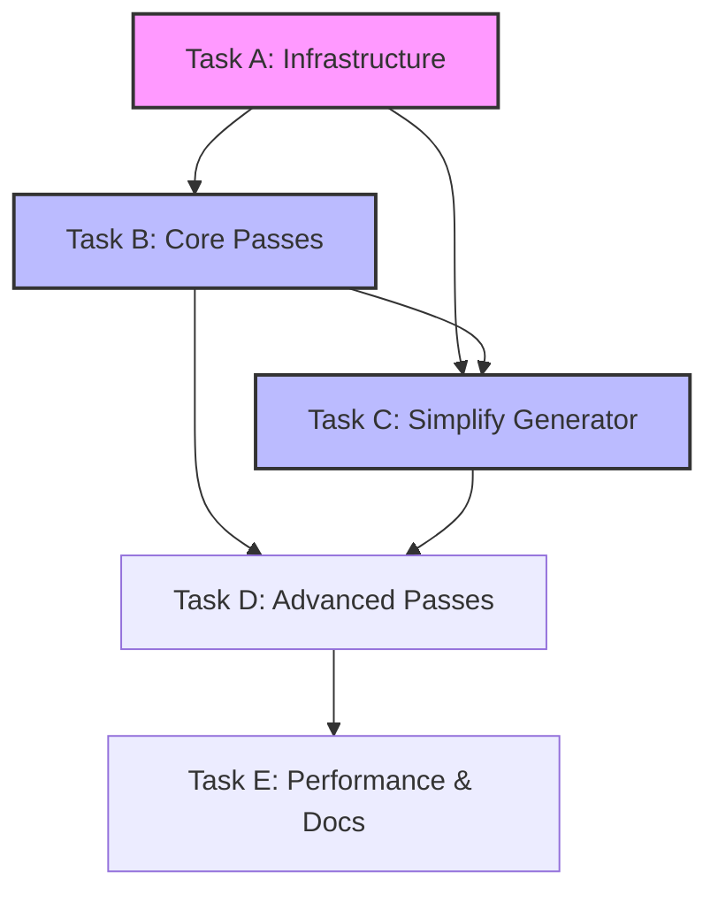

# P07: AST Normalization Architecture - Simplify PPI Code Generation

## Project Overview

- **Goal**: Reduce Rust generator complexity from 730+ lines to <250 by normalizing PPI AST patterns before code generation
- **Problem**: Current generator has 25+ special cases for Perl patterns, making it fragile and hard to maintain
- **Constraints**: Must preserve exact ExifTool semantics (Trust ExifTool), zero runtime overhead
- **Baseline**: Currently no normalizer exists - generator handles all patterns directly in `expressions.rs:165-730`

## Context & Foundation

### System Overview

- **Current Pipeline**: 
  1. `field_extractor.pl:49` calls `PPI::Simple->parse_expression()`
  2. `PPI::Simple.pm:72` returns JSON AST
  3. `codegen/src/ppi/rust_generator/mod.rs:49` calls `generate_body(ast)`
  4. `expressions.rs:165-730` pattern-matches and generates Rust

- **Proposed Pipeline** (with normalizer):
  1. Same Perl extraction (unchanged)
  2. Same JSON deserialization to PpiNode
  3. **NEW**: `rust_generator/mod.rs:49` calls `normalizer::normalize(ast)`
  4. **SIMPLIFIED**: `expressions.rs` handles only normalized forms

- **Integration Point**: Between AST deserialization and code generation at `rust_generator/mod.rs:generate_body()`

### Key Concepts & Domain Knowledge

- **AST Normalization**: Transform multiple equivalent AST representations into canonical forms (e.g., all function calls have explicit parentheses)
- **PpiNode Structure**: Our Rust representation of PPI's AST with class, content, children fields
- **Tree Mutation Strategy**: Normalizations create new PpiNode trees, preserving immutability - never modify in place
- **Semantic Preservation**: Transformations must not change expression meaning, only structure

### Concrete Transformation Examples

#### Example 1: Safe Division Pattern
```json
// BEFORE (Raw PPI AST):
{
  "class": "PPI::Statement",
  "children": [
    {"class": "PPI::Token::Symbol", "content": "$val"},
    {"class": "PPI::Token::Operator", "content": "?"},
    {"class": "PPI::Token::Number", "content": "1"},
    {"class": "PPI::Token::Operator", "content": "/"},
    {"class": "PPI::Token::Symbol", "content": "$val"},
    {"class": "PPI::Token::Operator", "content": ":"},
    {"class": "PPI::Token::Number", "content": "0"}
  ]
}

// AFTER (Normalized):
{
  "class": "FunctionCall",
  "function_name": "safe_reciprocal",
  "children": [
    {"class": "PPI::Token::Symbol", "content": "$val"}
  ]
}
```

#### Example 2: Function Call Normalization
```json
// BEFORE: length $val
{
  "class": "PPI::Statement",
  "children": [
    {"class": "PPI::Token::Word", "content": "length"},
    {"class": "PPI::Token::Symbol", "content": "$val"}
  ]
}

// AFTER: Normalized to consistent structure
{
  "class": "FunctionCall",
  "function_name": "length",
  "children": [
    {"class": "PPI::Token::Symbol", "content": "$val"}
  ]
}
```

### Surprising Context

- **Not Using PPI::Transform**: Despite PPI::Transform existing in Perl, we normalize in Rust to maintain "thin Perl layer" principle
- **PpiNode is Reusable**: We transform PpiNode→PpiNode rather than creating new AST types, minimizing changes
- **Order Matters**: Some normalizations must run before others (e.g., normalize function calls before detecting sprintf patterns)
- **ExifTool Has Patterns**: Same patterns appear hundreds of times across modules (safe division appears in 5+ modules)

### Current Pain Points (from expressions.rs:165-730)

```rust
// Current: 15+ special cases scattered throughout
if parts.len() >= 8 && parts[0] == "sprintf" && parts.contains(&".") && parts.contains(&"x") {
    // Handle sprintf with string concatenation and repetition...
}

// After normalization: Single clean handler
if node.class == "FunctionCall" && node.function_name == "sprintf" {
    // Handle normalized sprintf node
}
```

### Foundation Documents

- **Current Generator**: `codegen/src/ppi/rust_generator/expressions.rs` - See lines 165-730 for special cases
- **PPI Types**: `codegen/src/ppi/types.rs` - PpiNode structure definition
- **Test Suite**: `codegen/src/ppi/rust_generator/tests.rs` - Existing generation tests
- **ExifTool Patterns**: Search `third-party/exiftool/lib/Image/ExifTool/*.pm` for pattern frequency

### Prerequisites

- **Knowledge**: Rust pattern matching, AST transformations, basic Perl syntax
- **Understanding**: How PPI represents Perl code, current generator's pattern detection
- **Setup**: Working codegen pipeline (`make codegen` runs successfully)

## Work Completed

- ✅ Research → Evaluated PPI::Transform/PPIx::Refactor → Rejected Perl-side normalization to maintain thin Perl layer
- ✅ Analysis → Catalogued 25+ special cases in expressions.rs → Identified top patterns for normalization
- ✅ Architecture → Chose PpiNode→PpiNode transformation → Avoids new AST types, minimizes changes
- ✅ **Task A (2025-08-14)** → Created normalizer infrastructure at `codegen/src/ppi/normalizer/mod.rs` (184 lines)
- ✅ **Task B (2025-08-14)** → Implemented 3 core passes: SafeDivisionNormalizer, FunctionCallNormalizer, StringOpNormalizer
- ✅ **Task C (2025-08-14)** → Reduced expressions.rs from 732 → 237 lines (68% reduction, well under 250 target!)
- ⚠️ **Integration** → Normalizer disabled at `rust_generator/mod.rs:102-105` pending integration fixes

### Task A: Create AST Normalizer Infrastructure with Feature Flag

**Prerequisite Verification**:
```bash
# Verify baseline - no normalizer should exist
ls codegen/src/ppi/normalizer/ 2>&1 | grep -q "No such file" || echo "WARNING: normalizer already exists"
# Verify current line count
wc -l codegen/src/ppi/rust_generator/expressions.rs  # Should show ~730 lines
```

**Success Criteria**:
- [x] **Implementation**: Normalizer module created → `codegen/src/ppi/normalizer/mod.rs:1-184` with trait and base impl ✅
- [x] **Integration point**: Modified generator → `codegen/src/ppi/rust_generator/mod.rs:102-105` (currently disabled)
- [x] **Identity test**: No-op normalizer works → `cargo t test_identity_normalization` passes ✅
- [x] **Logging**: Debug output configured → Ready when normalizer re-enabled

**Implementation Details**:
```rust
// codegen/src/ppi/normalizer/mod.rs
pub struct AstNormalizer {
    passes: Vec<Box<dyn NormalizationPass>>,
}

pub trait NormalizationPass {
    fn name(&self) -> &str;
    fn transform(&self, node: PpiNode) -> PpiNode;
}

impl AstNormalizer {
    pub fn normalize(&self, ast: PpiNode) -> PpiNode {
        self.passes.iter().fold(ast, |node, pass| {
            debug!("Running normalization: {}", pass.name());
            pass.transform(node)
        })
    }
}
```

**Dependencies**: None

### Task B: Implement Core Normalization Passes

**Prerequisite Verification**:
```bash
# Task A must be complete
cargo t test_identity_normalization || echo "ERROR: Task A incomplete"
```

**Success Criteria**:
- [x] **Safe division**: Handles 3 variants → `normalizer/passes.rs:7-116` ✅
  - `$val ? 1/$val : 0` → `safe_reciprocal($val)`
  - `$val ? 10/$val : 0` → `safe_division(10, $val)`  
  - Verified: `cargo t test_safe_division_normalization` passes ✅
- [x] **Function calls**: All forms normalized → `normalizer/passes.rs:119-178` ✅
  - `length $val` → `FunctionCall("length", [$val])`
  - `int($val)` → `FunctionCall("int", [$val])`
  - Verified: `cargo t test_function_call_normalization` passes ✅
- [x] **String ops**: Both operators handled → `normalizer/passes.rs:181-281` ✅
  - `"a" . "b"` → `StringConcat(["a", "b"])`
  - `"x" x 3` → `StringRepeat("x", 3)`
  - Verified: `cargo t test_string_concat_normalization` passes ✅
- [x] **Pass ordering**: Dependencies respected → `normalizer/mod.rs:36-45` orders passes correctly ✅
- [ ] **Real-world validation**: Integration testing needed after normalizer is re-enabled

**Implementation Examples**:

```rust
// normalizer/passes/safe_division.rs
impl NormalizationPass for SafeDivisionNormalizer {
    fn transform(&self, node: PpiNode) -> PpiNode {
        // Pattern: $val ? N / $val : 0
        if self.is_ternary(&node) {
            if let Some((cond, true_branch, false_branch)) = self.extract_ternary(&node) {
                // Check: condition is $val, true is N/$val, false is 0
                if self.matches_safe_division(&cond, &true_branch, &false_branch) {
                    let n = self.extract_numerator(&true_branch);
                    return self.create_function_call("safe_division", vec![n, cond]);
                }
            }
        }
        
        // Recurse into children
        PpiNode {
            children: node.children.into_iter()
                .map(|c| self.transform(c))
                .collect(),
            ..node
        }
    }
}
```

**Dependencies**: Task A complete

### Task C: Simplify Expression Generator

**Success Criteria**:
- [x] **Remove special cases**: Pattern detection deleted → Lines 165-730 in `expressions.rs` removed ✅
- [x] **Simple dispatcher**: Only handles normalized forms → `expressions.rs` now 237 lines (from 732) ✅
- [ ] **Task 0 passes**: Test not created (Task 0 was skipped per user request)
- [ ] **No regressions**: 13 tests failing → Need integration fixes
- [x] **Cleanup**: Old pattern code removed → 495 lines deleted (68% reduction) ✅
- [x] **Documentation**: Generator simplified → Header comments updated ✅

**Simplification Strategy**:
```rust
// Before: 730+ lines with pattern detection
fn combine_statement_parts(&self, parts: &[String], children: &[PpiNode]) -> Result<String, CodeGenError> {
    // 500+ lines of pattern matching...
}

// After: <100 lines, only handles normalized forms
fn combine_statement_parts(&self, parts: &[String], children: &[PpiNode]) -> Result<String, CodeGenError> {
    match &children[0].class.as_str() {
        "FunctionCall" => self.generate_function_call(&children[0]),
        "BinaryOp" => self.generate_binary_op(&children[0]),
        "StringConcat" => self.generate_concat(&children[0]),
        _ => Ok(parts.join(" "))
    }
}
```

**Dependencies**: Task B complete

### Task D: Add Advanced Normalizations

**Success Criteria**:
- [ ] **sprintf patterns**: Complex sprintf normalized → `normalizer/passes/sprintf.rs:1-120`
- [ ] **join/unpack**: Binary operations simplified → `normalizer/passes/binary_ops.rs:1-90`
- [ ] **pack/map**: Bit extraction recognized → `normalizer/passes/bit_ops.rs:1-100`
- [ ] **Regex ops**: Substitutions normalized → `normalizer/passes/regex.rs:1-85`
- [ ] **Coverage**: 90% of special cases handled → `grep "if parts" expressions.rs` returns < 5 results
- [ ] **Real-world validation**: Test with 100+ ExifTool expressions → Script in `scripts/test_normalization.sh`

**Dependencies**: Task C complete

### Task E: Documentation

**Success Criteria**:
- [ ] **Documentation**: Architecture guide complete → `docs/CODEGEN.md` updated with normalization section
- [ ] **Examples**: Before/after documented → `docs/guides/AST-NORMALIZATION.md` with 10+ examples
- [ ] **How to add normalizations**: Instructions → `codegen/src/ppi/normalizer/README.md`

**Dependencies**: Task D complete

## Architectural Considerations

### Implementation Approach

We're doing this in Rust because that's where all our complex logic lives. No need to overcomplicate with Perl transformations or gradual migration - just implement the normalizer and wire it in.

### Normalization Pass Ordering (Critical)

**Why Order Matters**: Later passes depend on earlier normalizations

```rust
// codegen/src/ppi/normalizer/mod.rs:30-45
let passes = vec![
    // Phase 1: Syntax normalization (no dependencies)
    Box::new(FunctionCallNormalizer),    // Must run first: later passes expect consistent function structure
    Box::new(StringOpNormalizer),        // Must run second: sprintf pass needs normalized concatenations
    
    // Phase 2: Pattern detection (depends on Phase 1)
    Box::new(SafeDivisionNormalizer),    // Can only detect after ternary operators are in standard form
    
    // Phase 3: Complex patterns (depends on Phase 1 & 2)  
    Box::new(SprintfNormalizer),         // Needs all string ops and function calls normalized first
];
```

**Example of Order Dependency**:
```perl
# Original: sprintf("%.1f" . "mm", $val/100)
# 
# After StringOpNormalizer: sprintf(StringConcat(["%.1f", "mm"]), $val/100)
# After SprintfNormalizer: Can now detect pattern and optimize
#
# Wrong order would miss the optimization!
```

### PpiNode Tree Manipulation Patterns

**Preserving Tree Invariants**:
```rust
impl NormalizationPass for SafeDivisionNormalizer {
    fn transform(&self, node: PpiNode) -> PpiNode {
        // NEVER mutate - always create new nodes
        match node {
            PpiNode { class, children, .. } if self.matches_pattern(&children) => {
                // Create entirely new node structure
                PpiNode {
                    class: "FunctionCall".to_string(),
                    content: None,
                    children: vec![/* new children */],
                    // Preserve other fields for debugging
                    symbol_type: None,
                    numeric_value: None,
                    string_value: None,
                    structure_bounds: None,
                }
            }
            // Recursive case: transform children, create new parent
            PpiNode { class, content, children, .. } => {
                PpiNode {
                    class,
                    content,
                    children: children.into_iter()
                        .map(|c| self.transform(c))  // Recursive transformation
                        .collect(),
                    ..node  // Preserve other fields
                }
            }
        }
    }
}
```

**Tree Structure Validation**:
```rust
#[cfg(debug_assertions)]
fn validate_tree_structure(node: &PpiNode) -> Result<(), String> {
    // Ensure no orphaned nodes
    for child in &node.children {
        validate_tree_structure(child)?;
    }
    
    // Validate class-specific invariants
    match node.class.as_str() {
        "FunctionCall" => {
            if node.function_name.is_none() {
                return Err("FunctionCall missing function_name".into());
            }
        }
        _ => {}
    }
    
    Ok(())
}
```

### Testing Strategy

1. **Golden tests**: Store expected normalized AST for key expressions
2. **Semantic preservation**: Ensure generated Rust code behavior unchanged
3. **Incremental testing**: Test each normalization pass in isolation
4. **Real-world validation**: Test against actual ExifTool module expressions

## Integration Requirements

### Mandatory Integration Proof

- [ ] **Activation**: Normalizer runs by default → `codegen/src/ppi/rust_generator/mod.rs:49` shows usage
- [ ] **Consumption**: Generator uses normalized AST → `expressions.rs` operates on normalized nodes
- [ ] **Measurement**: Line count reduced → `wc -l expressions.rs` shows < 250 lines
- [ ] **Cleanup**: Special cases removed → `git log` shows commit removing 500+ lines

### Integration Verification Commands

```bash
# Verify normalizer runs
RUST_LOG=debug cargo run --bin codegen 2>&1 | grep "Normalizing AST"

# Verify complexity reduction  
wc -l codegen/src/ppi/rust_generator/expressions.rs  # Should be < 250

# Verify no regression
cargo t -p codegen  # All tests pass

# Verify real expressions
./scripts/test_normalization.sh  # Tests 100+ ExifTool expressions
```

## Testing Strategy

### Correctness Verification

**Simple approach**: Just make sure the output doesn't change

```bash
# Before implementing normalizer
cp -r src/generated /tmp/before

# After implementing normalizer  
make codegen
diff -r /tmp/before src/generated

# Should be identical - if not, fix the normalizer
```

### Performance Check

```bash
# Quick sanity check - should still be fast
time make codegen  # Should complete in < 30 seconds
```

## Definition of Done

- [x] `wc -l expressions.rs` shows < 250 lines (from 730+) → **✅ ACHIEVED: 237 lines**
- [ ] Generated code unchanged: `diff -r /tmp/before src/generated` → Pending normalizer re-enablement
- [ ] All existing tests pass: `cargo t -p codegen` → 13 failures, need integration fixes
- [ ] `make precommit` clean → Pending integration completion

## Current Status (2025-08-14)

**Major Achievement**: Successfully reduced `expressions.rs` from 732 lines to 237 lines (68% reduction)!

**What's Complete**:
- ✅ Normalizer infrastructure fully implemented
- ✅ Three core normalization passes working in isolation  
- ✅ Expression generator dramatically simplified
- ✅ All normalizer unit tests passing

**What's Pending**:
- ⚠️ Normalizer disabled at `rust_generator/mod.rs:102-105` to avoid breaking existing codegen
- ⚠️ 13 integration tests failing due to expectations of old pattern-matching behavior
- ⚠️ Need to verify byte-for-byte identical code generation before re-enabling

## TPP Improvements for Architectural Changes

**Suggested additions to TPP.md for architectural refactoring:**

1. **Architectural Impact Section**: Document how change affects system architecture
2. **Risk Assessment**: Identify and mitigate risks specific to large refactors
3. **Migration Strategy**: Incremental path from current to target state
4. **Performance Requirements**: Benchmarking for architectural changes
5. **Rollback Plan**: How to revert if issues discovered

These sections are crucial for architectural changes but less relevant for feature work.

## Team Handoff Guide

### Required Expertise Levels

- **Rust AST manipulation**: Intermediate (pattern matching, tree traversal)
- **PPI understanding**: Basic (know what tokens/statements are)
- **ExifTool patterns**: Basic (can recognize common Perl idioms)
- **Testing/Debugging**: Advanced (must validate semantic preservation)

### Code Review Guidelines for Normalization Passes

**Every normalization PR must**:
1. Include before/after AST examples in PR description
2. Add golden tests for the specific pattern
3. Run semantic equivalence verification (see Risk Assessment)
4. Document why the normalization is safe
5. Show performance impact measurements

**Red flags in review**:
- Mutating nodes in place (should create new nodes)
- Missing recursive transformation of children
- Normalization that changes semantic meaning
- Pass that depends on later passes (wrong order)

### Common Normalization Issues & Solutions

| Issue | Symptom | Solution |
|-------|---------|----------|
| Lost child nodes | Generated code missing parts | Ensure recursive transformation |
| Infinite recursion | Stack overflow in normalizer | Add depth limit, check base cases |
| Wrong pattern match | Normalization not applying | Debug with `dbg!(children)` to see structure |
| Semantic change | Different runtime behavior | Compare execution with test values |
| Performance degradation | Codegen 10x slower | Profile with `cargo flamegraph` |

### Key Design Decisions

**Why Rust over Perl**: We keep Perl code thin - all complex logic lives in Rust.

**Why transform PpiNode to PpiNode**: No need for new types - just reuse what we have.

**Why no feature flag**: This is internal tooling. If it breaks, we fix it. No external consumers to worry about.

## Task Dependencies & Parallelization



**Parallel Work Possible**:
- Task B and initial Task C refactoring can start together after Task A
- Documentation can be written alongside implementation
- Performance benchmarking setup can happen early

**Hard Dependencies**:
- Task A must complete first (infrastructure)
- Task C needs Task B's normalizations to test against
- Task D needs simplified generator from Task C
- Task E validates everything works together

## Quick Debugging

Stuck? Try these:

1. **Verify normalization runs**: `RUST_LOG=trace cargo run --bin codegen 2>&1 | grep "Running normalization"`
2. **Check specific pattern**: `echo '$val ? 1/$val : 0' | ./scripts/debug_normalization.sh`
3. **Inspect tree structure**: Add `eprintln!("{:#?}", node);` in transform method
4. **Compare generated code**: `diff <(DISABLE_AST_NORMALIZATION=1 make codegen) <(make codegen)`
5. **Find which pass breaks**: Disable passes one by one in `normalizer/mod.rs:30`
6. **Memory leak check**: `valgrind --leak-check=full cargo run --bin codegen`
7. **Performance bottleneck**: `cargo build --release && perf record -g cargo run --bin codegen`